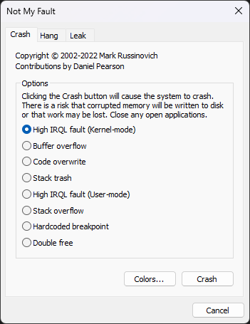
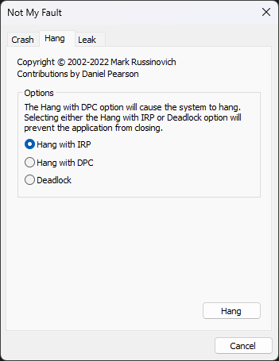
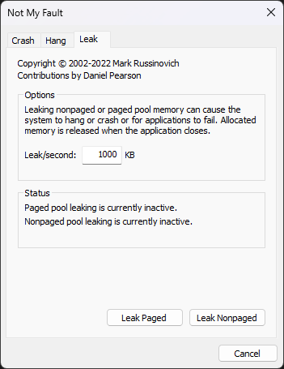

# NotMyFault
[NotMyFault](https://aka.ms/notmyfault), 직역하자면 "제가 한 게 아니에요"는 시스템 [충돌](BSOD.md), [응답 없음](https://ko.wikipedia.org/wiki/프리징_(컴퓨팅)), 그리고 [메모리 누수](https://ko.wikipedia.org/wiki/메모리_누수)를 의도적으로 일으키는 [Sysinternals](Sysinternals.md) 유틸리티 프로그램이다. 재미있는 사실은 이러한 문제를 일으키는 범인은 정말 따로 존재하는 데 바로 myfault.sys 드라이버이다. GUI 또는 명령어로 실행할 수 있는 프로그램이며, 반드시 관리자 권한으로 실행되어야 한다.

> 명령어 버전의 유티릴티는 notmyfaultc.exe 프로그램으로 충돌 및 프리징 증상을 일으킨다.

<table style="table-layout: fixed; width: 100%; margin: auto;">
<caption style="caption-side: top;">NotMyFault 어플리케이션 화면</caption>
<thead><tr><th style="text-align: center;">시스템 충돌</th><th style="text-align: center;">응답 없음</th><th style="text-align: center;">메모리 누수</th></tr></thead>
<tbody><tr style="overflow: auto;"><td style="overflow: inherit;">


</td><td style="overflow: inherit;">


</td><td style="overflow: inherit;">


</td></tr></tbody>
</table>

NotMyFault 유틸리티는 증상을 트러블슈팅하기 보다는 일부러 증상을 일으켜 트러블슈팅을 연습할 수 있도록 하는 프로그램이다.

## 시스템 충돌
총 여덟 가지의 시스템 충돌 요인 중 하나를 선택하여 Crash 버튼을 눌러 블루스크린을 발생시킨다.

시스템 콘솔로 충돌을 일으키려면 아래의 명령어를 입력한다: `crash_type_num`에는 1-8 범위의 숫자가 입력되는데, 이들은 다이얼로그 창에 나열된 시스템 충돌 원인들을 순서에 대응한다. 아래는 6번 선택지의 Stack overflow로 충돌을 일으키기 위한 명령이다.

```terminal
notmyfaultc.exe crash 6
```

## 응답 없음
총 세 가지의 응답 없음 증상을 일으키는 선택지가 있으며, 증상에 대한 설명은 아래 표를 참고한다.

<table style="width: 80%; margin: auto;">
<caption style="caption-side: top;">NotMyFault 응답 없음 선택지</caption>
<thead><tr><th style="text-align: center;">선택지</th><th style="text-align: center;">대상</th><th style="text-align: center;">증상</th></tr></thead>
<tbody>
<tr><td style="text-align: center; width: 20%">Hang with <a href="https://en.wikipedia.org/wiki/I/O_request_packet">IRP</a></td><td style="text-align: center; width: 20%">드라이버</td><td>myfault.sys 드라이버를 먹통으로 만들어 시스템 충돌도 일으킬 수 없다.</td></tr>
<tr><td style="text-align: center; width: 20%">Hang with <a href="Processor.md#지연-프로시저-호출">DPC</a></td><td style="text-align: center; width: 20%">시스템</td><td>시스템 자체가 아무런 반응이 없어 강제 종료 혹은 <a href="BSOD.md#강제-시스템-충돌">시스템 충돌</a>을 일으켜야 한다.</td></tr>
<tr><td style="text-align: center; width: 20%"><a href="https://ko.wikipedia.org/wiki/교착_상태">Deadlock</a></td><td style="text-align: center; width: 20%">어플리케이션</td><td>어플리케이션 자체가 아무런 반응이 없으며 <a href="Process.md">프로세스</a> 강제 종료도 되지 않는다.</td></tr>
</tbody>
</table>

시스템 콘솔로 시스템 혹은 드라이버 응답 없음을 일으키려면 아래의 명령어를 입력한다 (단, 세 번째 선택지의 Deadlock은 터미널로 일으킬 수 없다). 아래는 2번 선택지인 Hang with DPC로 시스템 행을 일으키기 위한 명령이다.

```terminal
notmyfaultc.exe hang 2
```

## 메모리 누수
윈도우는 두 종류의 [커널 메모리](Memory.md#메모리-풀)가 있으며, 이들은 각각 페이징 풀(paged pool)과 비페이징 풀(nonpaged pool)이다.

NotMyFault 프로그램은 둘 중 하나를 초당 원하는 [킬로바이트](https://ko.wikipedia.org/wiki/킬로바이트) 단위만큼 누수시킬 수 있다. 커널 메모리의 누수로 메모리 풀이 소진되면 시스템은 응답이 없거나 충돌이 발생할 수 있으며, 혹은 어플리케이션이 비정상적으로 종료될 수 있다. [작업 관리자](https://ko.wikipedia.org/wiki/작업_관리자)나 [성능 모니터](Performance_Monitor.md)로부터 커널 메모리가 증가하는 게 수치적으로 볼 수 있으며, 사용 가능한 메모리가 부족해지면서 시스템 성능이 저하되는 증상을 목격할 수 있다.

> 만일 고급 시스템 설정의 [가상 메모리](Memory.md#페이징-파일)가 "시스템이 관리하는 크기"로 지정되어 있으면 메모리가 부족할 때마다 커밋된 메모리 용량이 자동으로 늘어나므로 증상이 다소 늦게 나타난다.
