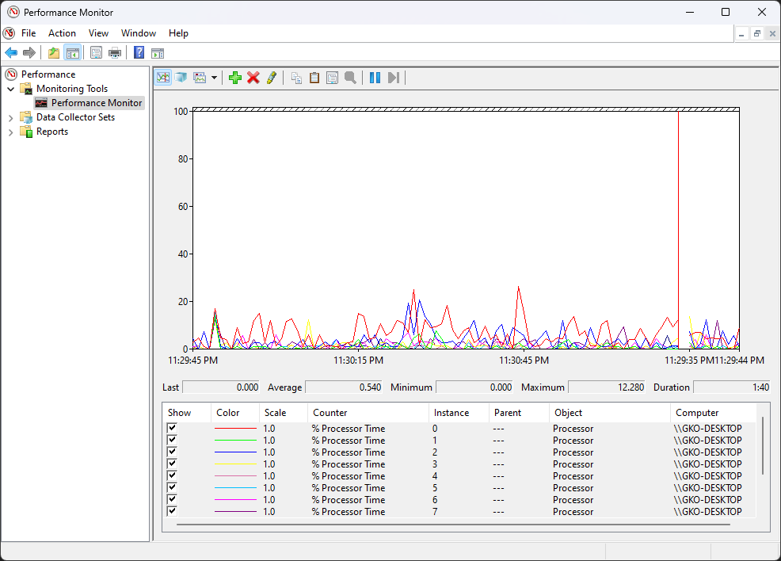
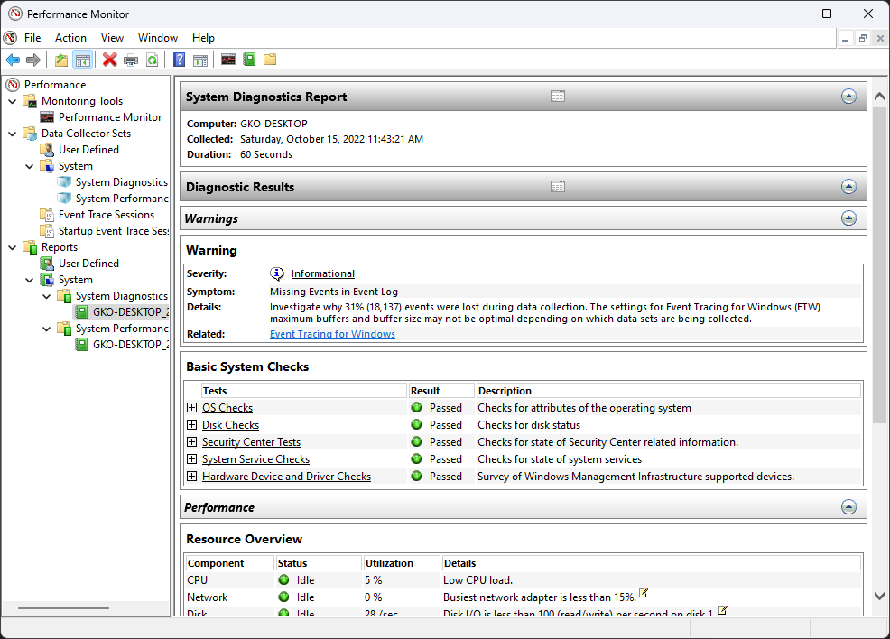
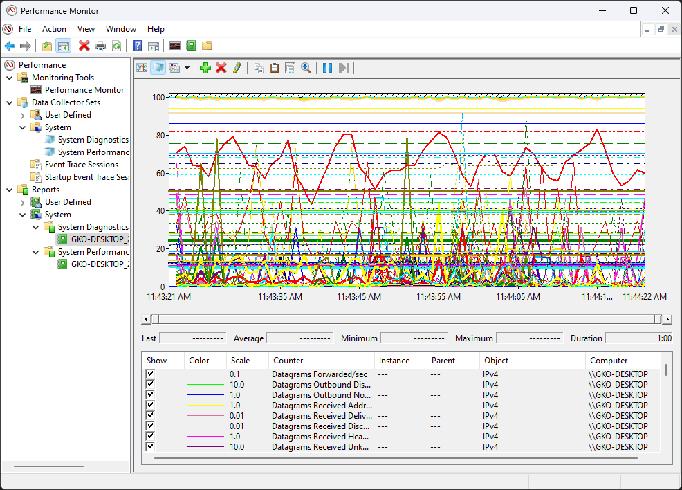
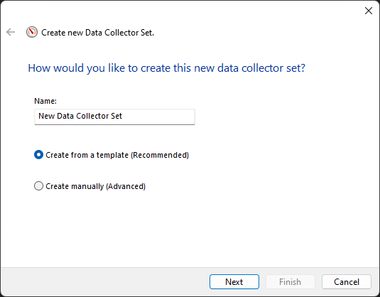
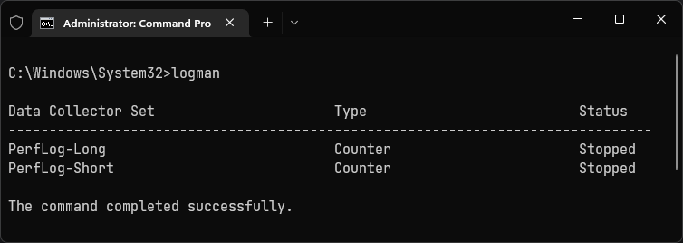

# 성능 모니터
[성능 모니터](https://learn.microsoft.com/en-us/previous-versions/windows/it-pro/windows-server-2008-r2-and-2008/cc749249(v=ws.11))(Performance Monitor; 일명 Perfmon)는 시스템 및 어플리케이션의 전반적인 성능 데이터를 수집하여 수치적 모니터링을 제공하는 도구이다.



성능 모니터는 [윈도우](Windows.md) 운영체제에 기본적으로 설치된 프로그램이며, 모니터링 이외에도 이상 현상이 목격되었을 시 시스템 성능을 기록 및 진단하기 위해 사용된다. 시스템 성능 진단에는 유용하나 RCA, 즉 증상의 [근본적인 원인 분석](https://en.wikipedia.org/wiki/Root_cause_analysis)에는 적합하지 않아 [WPR](WPR.md) 및 [WPA](WPA.md) 프로그램이 활용되기도 한다.

## 데이터 수집기 집합
[데이터 수집기 집합](https://learn.microsoft.com/en-us/previous-versions/windows/it-pro/windows-server-2008-r2-and-2008/cc749337(v=ws.11))(Data Collector Sets)은 시스템 관련 정보를 수집하는 다수의 데이터 수집기들을 하나의 집합으로 정리하여 파일 형태의 [로그](https://ko.wikipedia.org/wiki/로그파일)로 저장하거나 검토할 수 있도록 한다.





위의 두 그림은 기본적으로 제공된 데이터 수집기 집합 중 하나인 "시스템 진단(System Diagnostics)"으로부터 수집된 시스템 정보를 각각 보고서 및 성능 모니터로 나타낸 것이다. 로그 파일은 일반적으로 `%SystemDrive%\PerfLogs` 경로에 `.BLG` 확장자 파일로 저장된다.

다음은 성능 모니터의 데이터 수집기로부터 수집될 수 있는 데이터들의 유형을 소개한다.

* [성능 카운터](#성능-카운터)
* [이벤트 추적 데이터](ETW.md)
* 시스템 구성 정보

### 성능 카운터
[성능 카운터](https://learn.microsoft.com/en-us/windows/win32/perfctrs/about-performance-counters)(Performance counter)는 운영체제 혹은 개별 어플리케이션에 관여되는 시스템 상태 및 활동 측정을 제공한다. 고급 추상화 계층의 인터페이스를 통해 [프로세서](Processor.md), [메모리](Memory.md), [디스크](Storage.md) 등에 대한 성능 데이터가 제공되는 데, 성능 모니터의 카운터는 다음과 같이 표시된다.

```terminal
\\Machine\Object(Instance)\Counter
```

<table style="table-layout: fixed; width: 100%; margin-left: auto; margin-right: auto;"><caption style="caption-side: top;">성능 모니터의 카운터 구성</caption><colgroup><col style="width: 25%;"/><col style="width: 25%;"/><col style="width: 25%;"/><col style="width: 25%;"/></colgroup><thead><tr><th style="text-align: center;"><code>Machine</code></th><th style="text-align: center;"><code>Object</code></th><th style="text-align: center;"><code>Instance</code></th><th style="text-align: center;"><code>Counter</code></th></tr></thead><tbody><tr style="text-align: center;"><td>로컬 혹은 원격 머신</td><td>시스템 객체 (일명 카운터집합; counterset)<br/><sub style="font-style: italic;">프로세서, 프로세스, 메모리, 디스크, 네트워크 등</sub></td><td>시스템 객체의 세부 항목 (일명 인스턴스)<br/><sub style="font-style: italic;">CPU 코어 번호, 프로세스명, 디스크 드라이브 등</sub></td><td>시스템 객체의 상태 및 활동 데이터<br/><sub style="font-style: italic;">CPU 사용량, 프로세스 메모리 점유율, 디스크 전송률 등</sub></td></tr></tbody></table>

성능 카운터로부터 데이터를 수신받는 주체를 소비자(consumer)라고 부르며 성능 모니터 이외에도 [작업 관리자](https://ko.wikipedia.org/wiki/작업_관리자), [리소스 모니터](https://en.wikipedia.org/wiki/Resource_Monitor), [`logman.exe`](#logman) 등의 프로그램이 해당한다. 반면, 소비자가 호출한 카운터의 성능 데이터를 생성 및 발행하는 소프트웨어 구성요소를 제공자(provider)라고 부른다. [윈도우 비스타](https://ko.wikipedia.org/wiki/윈도우_비스타)를 기점으로 사용자 모드 제공자는 두 버전으로 나뉘어진다.

* **V1 제공자** <sub>(deprecated)</sub>

    소비자가 성능 데이터를 확인하려고 할 때, 성능 라이브러리(일명 성능 DLL; `PDH.DLL`)가 소비자 프로세스에 로드되어 `.INI` 초기화 파일로 설치된 제공자를 호출하여 성능 데이터를 수집한다.

* **V2 제공자**

    `.MAN` 파일로부터 제공자, 카운터집합, 그리고 카운터를 정의하면 [CTRPP](https://learn.microsoft.com/en-us/windows/win32/perfctrs/ctrpp) 도구로부터 제공자 프로세스를 제작하는 데 필요한 리소스들이 생성된다. 제공자 API(provider API)를 통해 제공자 내의 데이터가 관리되다. 소비자가 성능 데이터를 요청할 시, [작업자 스레드](https://learn.microsoft.com/en-us/windows-hardware/drivers/kernel/system-worker-threads)(worker thread)가 할당되어 시스템 관리 버퍼에 저장된 성능 데이터를 복사하여 소비자에게 반환한다.

## 성능 데이터 수집
> 본 부문은 이벤트 추적 데이터 및 시스템 구성 정보를 제외한 순전히 성능 카운터만을 다루는 데이터 수집기 집합에 대하여 유의할 사항들을 위주로 설명한다.

성능 모니터의 좌측 메뉴에서 *데이터 수집기 집합 > 사용자 지정* 경로는 사용자가 원하는 데이터 수집기 집합을 직접 구성할 수 있는 공간이다. RMB 클릭하여 *새로 만들기* 옵션을 통해 데이터 수집기 집합을 선택하면 아래와 같은 창이 나타난다.



성능 데이터 수집이 어떻게 설정되었는지에 따라 시스템에 가해지는 부하가 상이하지만, 이러한 영향을 줄이는 일환으로 다음 사항들을 유의해야 한다.

* **필요한 카운터 위주로 선택**

    한 객체에 대한 성능 데이터를 통째로 수집하기보다 필요한 카운터만 선택적으로 수집하기를 권장한다. 특히 엄청난 개수의 인스턴스를 가진 `\Thread(*)` 객체는 가급적 기피하도록 한다.

* **샘플링 간격은 적당히 선택**

    샘플링 간격이 너무 좁으면 수집되는 성능 데이터가 많아지므로 로그 파일의 크기가 커지는 건 물론, 데이터 수집에 동원되는 CPU의 사용량도 함께 증가한다. 반면, 간격이 너무 넓으면 정작 중요한 데이터를 놓칠 수 있는 위험이 있어 통계의 신뢰성이 떨어진다.

## 성능 데이터 분석
성능 모니터에 표시될 수 있는 데이터 개수는 카운터당 1,000개로 제한된다. 개수를 초과한다 하여도 성능 데이터가 손실되는 건 아니지만 수치가 그래프에 온전히 반영되지 않을 수 있다. 이러한 경우 그래프 구간을 확대할 시 데이터 평균화에 의해 나타나지 않았던 양상이 목격될 수도 있다. 그러므로 성능 모니터에 표시된 그래프의 과도한 의존은 잘못된 분석을 야기한다.

# Logman
[`logman.exe`](https://learn.microsoft.com/en-us/windows-server/administration/windows-commands/logman)는 [이벤트 추적 세션](ETW.md) 및 [성능 로그](#성능-데이터-수집)를 생성하기 위해 여럿 [성능 모니터](#성능-모니터)의 함수를 명령어로 지원하는 [윈도우](Windows.md)에 기본적으로 내장된 프로그램이다.



# 같이 보기
* [Windows Performance Monitor Overview - Microsoft Community Hub](https://techcommunity.microsoft.com/t5/ask-the-performance-team/windows-performance-monitor-overview/ba-p/375481)
