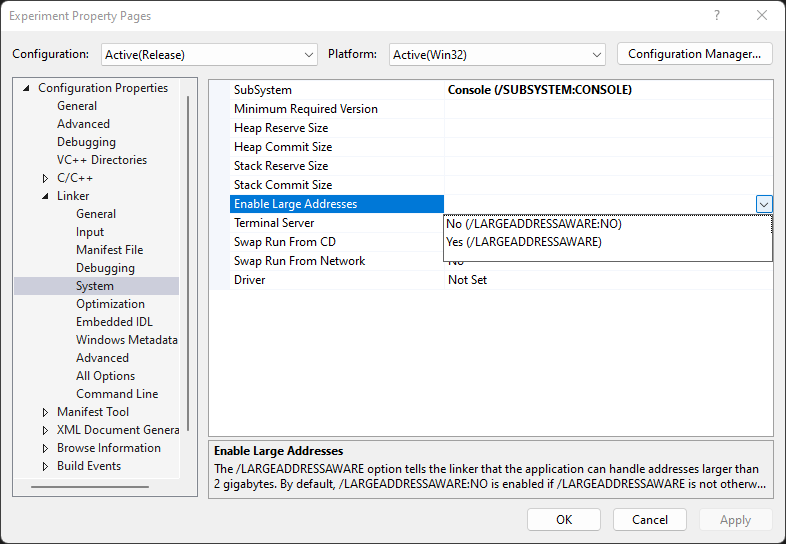

# 프로세스
[프로세스](https://en.wikipedia.org/wiki/Process_(computing))(process)는 [.exe](https://en.wikipedia.org/wiki/.exe) 확장자 파일 유형과 같은 [어플리케이션](https://en.wikipedia.org/wiki/Application_software) 등의 [프로그램](https://en.wikipedia.org/wiki/Computer_program)을 실행하기 위해 필요한 데이터와 리소스를 담는 컨테이너이다. 프로세스와 프로그램은 엄연히 다른 존재이며, 후자는 [C](C.md)/[C++](Cpp.md) 등의 프로그래밍 언어로 작성된 코드를 [기계어](https://en.wikipedia.org/wiki/Machine_code)의 집합체로 컴파일하여 생성된 부산물이다. 즉 프로그램은 동작 방식이 단순 코드로 작성된 [이미지](https://en.wikipedia.org/wiki/Executable)에 불과하며, 이를 실행에 옮기는 주체가 바로 프로세스이다.

> 객체지향 프로그래밍 개념에 빗대어 프로세스를 프로그램의 객체(instance)라고 상당수의 문서에서 자주 언급되는 편이다.

동일한 프로그램에서 실행되어도, [가상 주소 공간](#가상-주소-공간)에 의해 각 프로세스는 서로에게 영향을 미치지 않으며 자신만의 작업을 수행할 수 있다.

## 가상 주소 공간
> *참고: [Pushing the Limits of Windows: Virtual Memory](https://techcommunity.microsoft.com/t5/windows-blog-archive/pushing-the-limits-of-windows-virtual-memory/ba-p/723750)*

**[가상 주소 공간](https://en.wikipedia.org/wiki/Virtual_address_space)**(virtual address space; VAS)은 프로세스마다 [가상 메모리](Memory.md#가상-메모리)가 할당되는 주소 공간이다. 프로세스마다 주어지는 개별적인 메모리 공간이기 때문에, 일반적으로 타 프로세스에서 접근이 불가하여 어떠한 영향을 미치거나 받지 않는다. 비록 프로세스별 주어지는 주소 공간이지만 *사용자 공간* 그리고 *커널 공간*으로 나뉘어지며 이들에 대한 설명은 다음과 같다:

* **[사용자 공간](https://en.wikipedia.org/wiki/User_space_and_kernel_space)**(user space)

    개별 프로세스의 데이터 및 리소스가 저장되는 "프로세스 공간"이다. 사용자 공간은 모든 프로세스마다 각각 주어지며, 타 프로세스에서 단순 접근이 절대로 불가한 구조이다. 프로세스가 충돌하여도 시스템 및 나머지 프로세스에는 아무런 타격이 없으며 온전히 실행된다. 즉, 가상 주소 공간의 격리성은 바로 사용자 공간의 특성에서 비롯된 것이다.

* **[커널 공간](https://en.wikipedia.org/wiki/User_space_and_kernel_space)**(kernel space)

    프로세스가 실행되기 위해 반드시 필요한 운영체제 [커널](Kernel.md)의 데이터 및 리소스가 저장되는 "시스템 공간"이다. 커널 공간은 성능 및 효율성을 위해 모든 프로세스가 하나의 커널 공간을 공용하여 동일한 정보를 가진다. 그러나 프로세스는 ([드라이버](Driver.md)를 활용하지 않는 이상) 하드웨어 차원의 보안 조치에 의해 커널 공간을 함부로 접근할 수 없다.

가상의 메모리 공간이므로 설치된 [물리 메모리](Memory.md) 용량에 제약을 받지 않는다. 32비트와 64비트 [운영체제](https://en.wikipedia.org/wiki/Operating_system)는 이론상 각각 4 GB (= 2<sup>32</sup>) 그리고 16 EB (= 2<sup>64</sup>) 범위의 주소를 표현할 수 있다. 

<table style="table-layout: fixed; width: 95%; margin-left: auto; margin-right: auto;"><caption style="caption-side: top;">운영체제 및 프로세스 아키텍처에 따른 VAS의 <a href="https://learn.microsoft.com/en-us/windows/win32/memory/memory-limits-for-windows-releases#memory-and-address-space-limits">메모리 제한</a></caption><colgroup><col style="width: 10%;"/><col style="width: 10%;"/><col style="width: 40%;"/><col style="width: 40%;"/></colgroup><thead><tr><th colspan="2" style="text-align: center;">프로세스</th><th style="text-align: center;">32비트 운영체제</th><th style="text-align: center;">64비트 운영체제</th></tr></thead><tbody style="vertical-align: top;"><tr><td rowspan="2" style="text-align: center; vertical-align: middle;">32비트</td><td style="text-align: right; vertical-align: middle;">사용자 공간</td><td><b>IMAGE_FILE_LARGE_ADDRESS_AWARE</b> 해제 (기본값)<br/><ul><li>윈도우 NT: 2 GB</li></ul><b>IMAGE_FILE_LARGE_ADDRESS_AWARE</b><ul><li>윈도우 NT: 3 GB</li></ul></td><td><b>IMAGE_FILE_LARGE_ADDRESS_AWARE</b> 해제 (기본값)<br/><ul><li>윈도우 NT: 2 GB</li></ul><b>IMAGE_FILE_LARGE_ADDRESS_AWARE</b> 설정<ul><li>윈도우 NT: 4 GB</li></ul></td></tr><tr><td style="text-align: right; vertical-align: middle;">커널 공간</td><td><b>IMAGE_FILE_LARGE_ADDRESS_AWARE</b> 해제 (기본값)<br/><ul><li>윈도우 NT: 2 GB</li></ul><b>IMAGE_FILE_LARGE_ADDRESS_AWARE</b> 설정<ul><li>윈도우 NT: 1 GB</li></ul></td><td><ul><li>윈도우 8 및 이전: 8 TB</li><li>윈도우 8.1 및 이후: 128 TB</li></ul></td></tr><tr><td rowspan="2" style="text-align: center; vertical-align: middle;">64비트</td><td style="text-align: right; vertical-align: middle;">사용자 공간</td><td style="text-align: center; vertical-align: middle;">-</td><td><b>IMAGE_FILE_LARGE_ADDRESS_AWARE</b> 해제<ul><li>윈도우 NT: 2 GB</li></ul><b>IMAGE_FILE_LARGE_ADDRESS_AWARE</b> 설정 (기본값)<br/><ul><li>윈도우 8 및 이전: 8 TB</li><li>윈도우 8.1 및 이후: 128 TB</li></ul></td></tr><tr><td style="text-align: right; vertical-align: middle;">커널 공간</td><td style="text-align: center; vertical-align: middle;">-</td><td ><ul><li>윈도우 8 및 이전: 8 TB</li><li>윈도우 8.1 및 이후: 128 TB</li></ul></td></tr></tbody></table>

여기서 IMAGE_FILE_LARGE_ADDRESS_AWARE 플래그는 프로세스의 사용자 공간을 2 GB 제한보다 확장할 지 여부를 결정하는 어플리케이션 빌드 항목이다. 비주얼 스튜디오에서는 프로젝트 속성 중 `/LARGEADDRESSAWARE` 구성을 아래 그림과 같이 참고한다.



## 시스템 프로세스
시스템 프로세스(system processes)는 운영체제 구동을 위해 반드시 존재하는 프로세스들을 가리킨다. 이들은 작업 관리자의 *세부 정보* 탭이나 [프로세스 탐색기](Procexp.md)를 통해 직접 확인이 가능하다.

* **[유휴 프로세스](https://en.wikipedia.org/wiki/System_Idle_Process)**(Idle process)

    [프로세서](Processor.md#프로세서)가 아무런 작업을 하지 않고 있음을 나타내기 위한 실체가 없는 PID 0의 가짜 프로세스이다. 만일 유휴 프로세스의 프로세서 사용량이 90%로 집계된 경우, 이는 반대로 프로세서의 10%만이 실제로 실행 중인 프로세스를 처리하는 작업에 동원되고 있음을 의미한다. 이러한 이유로 유휴 프로세스의 [스레드](#스레드) 개수는 시스템의 [논리 프로세서](Processor.md#논리-프로세서) 개수와 일치한다.

* **시스템 프로세스**(System process)

    [Ntoskrnl.exe](Kernel.md#nt-커널) 또는 로드된 [드라이버](Driver.md) 등의 [커널](Kernel.md#커널) 스레드를 반영하기 위한 PID 4의 특수한 프로세스이다. 시스템 프로세스는 "프로세스 자체"를 가리키는 게 아닌, [커널 모드](Processor.md#권한-수준)에서 생성된 "시스템 스레드의 집합"을 지칭한다. 시스템 스레드는 일반 사용자 모드 스레드와 동일한 속성과 컨텍스트을 지니고 있으나, [프로세스 공간](#가상-주소-공간)의 주소가 존재하지 않으며 오로지 [시스템 공간](#가상-주소-공간)의 코드만 실행한다.

    > 즉 어떤 프로세스라도 장치 드라이버를 통해 스레드를 생성하면 이 또한 시스템 스레드가 되기 때문에 트러블슈팅 과정에서 유의해야 한다.

    * *보안 시스템 프로세스(Secure System process)*

        [VTL1](Hypervisor.md#가상-보안-모드) 보안 커널 주소 공간, 핸들, 그리고 시스템 스레드가 상주하는 프로세스이다. [스케줄링](Processor.md#스케줄링), 객체 및 메모리 관리는 VTL0 커널에서 이루어지기 때문에 실질적인 운영체제 동작에는 아무런 관여를 하지 않는다. 해당 프로세스는 단순히 사용자에게 [VBS](Hypervisor.md#가상화-기반-보안)가 활성화되었음을 가시화하는 게 전부이다.

* **[메모리 압축 프로세스](https://en.wikipedia.org/wiki/Virtual_memory_compression)**(Memory Compression process)

    프로세스의 가상 주소 공간으로부터 [페이징 아웃](Memory.md#페이징-파일) 될 페이지를 [HDD](https://ko.wikipedia.org/wiki/하드_디스크_드라이브) 또는 [SSD](https://ko.wikipedia.org/wiki/솔리드_스테이트_드라이브)와 같은 [보조기억장치](Storage.md)로 보내기 전에 압축시켜 [물리 메모리](Memory.md)에 상주시키는 기법을 활용할 수 있다. 이때 타 프로세스의 [워킹 세트](Memory.md#워킹-세트)로부터 방출되어 압축된 [대기 메모리](Memory.md#캐시-메모리)가 바로 메모리 압축 프로세스의 사용자 주소 공간에 저장된다. 그러므로 메모리 압축 프로세스의 워킹 세트는 작업 관리자의 메모리 성능에 표시된 "(압축)" 크기와 일치한다.

### 세션 관리자
[세션 관리자](https://ko.wikipedia.org/wiki/세션_관리자_하위_시스템)(Session Manager; smss.exe)는 윈도우 운영체제에서 가장 최초로 생성되는 사용자 모드 프로세스이다.

## 핸들
[핸들](https://ko.wikipedia.org/wiki/핸들_(컴퓨팅))(handle)은 프로세스가 파일이나 오브젝트와 같은 리소스에 접근하거나 불러오기 위해 사용하는 추상적인 [참조](C.md#포인터)이다. 일반적으로 핸들을 아래와 같이 선언한다.

```c
typedef void* HANDLE;
```

비록 핸들은 `void` 자료형 포인터로 나타날지언정, 가상 메모리상 데이터가 위치한 주소를 직접적으로 가리키는 포인터와 엄밀히 다른 존재이다. 가상 주소 공간 안에는 리소스들의 포인터가 나열된 배열 혹은 테이블이 있는데, 여기서 원하는 리소스에 접근하기 위한 테이블 진입점을 색인하는 요소가 바로 핸들이다. 만일 어떠한 이유로 리소스 포인터가 바뀌었다 하여도, 테이블에서의 해당 리소스 진입점은 여전하기 때문에 핸들의 유효성이 그대로 유지된다는 점에서 "추상적"인 참조라고 언급하였다.

리소스의 핸들을 생성 및 제거하는 것을 각각 열고(open) 닫는다(close)고 표현한다. 더 이상 사용되지 않는 리소스의 열린 핸들을 전부 닫아주지 않으면 프로세스가 종료될 때까지 테이블 및 메모리에 리소스가 계속 잔여하는 [핸들 누수](https://ko.wikipedia.org/wiki/핸들_누수)(handle leak) 문제가 발생한다.

# 스레드
[스레드](https://ko.wikipedia.org/wiki/스레드_(컴퓨팅))(thread)는 프로세스의 프로그램 이미지 코드를 실행하기 위해 [CPU](Processor.md)에서 처리할 수 있는 작업 흐름의 단위이다. 프로세스는 기본적으로 하나의 스레드를 갖는데 개발자의 설계에 의해 추가로 생성하여 두 개 이상의 스레드를 활용할 수 있고, 동일한 가상 주소 공간에 상주하기 때문에 서로의 리소스를 아무런 제약없이 공유할 수 있다. 그러나 프로세스에는 최소한 하나의 스레드가 존재해야 하므로, 모든 스레드가 종료되면 해당 프로세스는 자동적으로 함께 종료된다.
