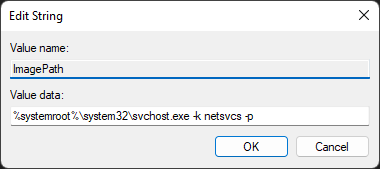

# 윈도우 서비스
**[윈도우 서비스](https://en.wikipedia.org/wiki/Windows_service)**(Windows Service)는 [서비스 제어 관리자](#서비스-제어-관리자)로부터 관리받는 프로그램이다.

<table style="width: 80%; margin-left: auto; margin-right: auto;"><caption style="caption-side: top;">프로세스와 서비스의 차이</caption><colgroup><col style="width: 15%;"/><col style="width: 45%;"/><col style="width: 20%;"/><col style="width: 20%;"/></colgroup><thead><tr><th style="text-align: center;">프로그램</th><th style="text-align: center;">생명주기</th><th style="text-align: center;">복수 객체의 존재 가능</th><th style="text-align: center;">GUI 활용 가능</th></tr></thead><tbody><tr><td style="text-align: center;"><a href="Process.md">프로세스</a></td><td>사용자 세션에 종속</td><td style="text-align: center;">✔️</td><td style="text-align: center;">✔️</td></tr><tr><td style="text-align: center;">서비스</td><td>서비스만을 위한 ID 0의 전용 세션에서 실행</td><td style="text-align: center;">❌<br/>(각 서비스마다 객체 하나만 존재)</td><td style="text-align: center;">❌<br/>(기피되어야 할 사항)</td></tr></tbody></table>

> 위의 표로부터 다음과 같은 서비스 성질을 파악할 수 있다: (1) 사용자 로그인 없이도 실행되며 (2) 사용자가 로그아웃 하여도 실행된다.

서비스는 서비스 제어 관리자에서 지정된 [인터페이스](https://en.wikipedia.org/wiki/API) 규칙을 반드시 준수해야 한다. 즉, 단순히 프로그램이 백그라운드에서 동작하고 있다는 이유로 서비스라고 추정해서는 안된다. 서비스의 실행과 중단은 전부 API를 통해 이루어지기 때문에 사용자 및 외부 프로세스의 간섭이 최소화된다.

### 보호된 서비스
**보호된 서비스**(protected service)는 시스템에 추가적인 보호를 제공하는 서비스이다.

1. 조기 실행 맬웨어 방지(Early Launch Antimalware; ELAM)
2. 이진 서명

서비스 제어 관리자는 보호된 서비스를 시작하기 전에 자격 유효성을 검증하며, 비보호 프로세스 및 관리자 권한으로도 보호된 서비스를 중지할 수 없다.

## 서비스 제어 관리자
**[서비스 제어 관리자](https://ko.wikipedia.org/wiki/서비스_제어_관리자)**(Service Control Manager; SCM), 일명 [`services.exe`](https://www.file.net/process/services.exe.html) 프로그램은 [윈도우](Windows.md)에서 서비스를 구동 및 관리하는 프로세스이다. 시스템이 [부팅](Boot.md)되어 운영체제가 초기화되는 과정에서 실행되는 프로세스이며, 등록된 서비스들은 아래 [레지스트리 키](Registry.md)에서 찾아볼 수 있다.<sup>[<a href="https://learn.microsoft.com/en-us/windows-hardware/drivers/install/hklm-system-currentcontrolset-services-registry-tree">참고</a>]</sup>

```terminal
HKLM\SYSTEM\CurrentControlSet\Services
```

각 서비스마다 하위 레지스트리 키가 개별 존재하며, 설정할 수 있는 값들은 알파벳 순서대로 나열한다:

<table style="width: 95%; margin-left: auto; margin-right: auto;"><caption style="caption-side: top;">Services의 하위 서비스 레지스트리 키 구성</caption><colgroup><col style="width: 15%;"/><col style="width: 15%;"/><col style="width: 70%;"/></colgroup><thead><tr><th style="text-align: center;">레지스트리 값</th><th style="text-align: center;">종류</th><th style="text-align: center;">설명</th></tr></thead><tbody><tr><td><code>DependOnService</code></td><td style="text-align: center;">REG_MULTI_SZ</td><td>실행하기 전에 먼저 실행되어야 할 서비스 혹은 그룹을 지정한다.</td></tr><tr><td><code>DisplayName</code></td><td style="text-align: center;">REG_SZ</td><td>사용자가 식별할 수 있도록 표시될 서비스 이름을 기입한다.</ul></td></tr><tr><td><code>ErrorControl</code></td><td style="text-align: center;">REG_DWORD</td><td>서비스 시작 실패 시 간주할 오류 심각도와 조치를 설정한다.<br/><ul><li>0x0: 오류를 무시하고 서비스 시작 작업을 재개한다.</li><li>0x1: 오류를 이벤트 로그에 기록하고 서비스 시작 작업을 재개한다.</li><li>0x2: 오류를 이벤트 로그에 기록하며, 시스템 재부팅 이후 LKG 구성에서 실행을 재개한다.</li><li>0x3: 오류를 이벤트 로그에 기록하며, 시스템 재부팅 이후 LKG 구성에서 실행을 중단한다.</li></ul></td></tr><tr><td><code>ImagePath</code></td><td style="text-align: center;">REG_EXPAND_SZ</td><td>서비스를 실행하는 바이너리 파일의 전체 경로를 가리키며, 전달 인자 기입을 허용한다.</td></tr><tr><td><code>Start</code></td><td style="text-align: center;">REG_DWORD</td><td>서비스 실행 시점을 설정한다.<br/><ul><li>0x0: [<a href="Driver.md#장치-드라이버">장치 드라이버</a> 전용] 시스템이 부팅될 때 <a href="Boot.md#부트로더">부트로더</a>에 의해 실행</li><li>0x1: [장치 드라이버 전용] 시스템이 초기화될 때 IoInitSystem 루틴에 의해 실행</li><li>0x2: SCM에 의해 시스템이 시작될 때 자동으로 실행</li><li>0x3: SCM에 의해 프로세스가 <a href="https://learn.microsoft.com/en-us/windows/win32/api/winsvc/nf-winsvc-startservicew">StartService</a> 함수를 호출할 때 실행</li><li>0x4: 서비스 실행 비활성</li></ul></td></tr><tr><td><code>Type</code></td><td style="text-align: center;">REG_DWORD</td><td>서비스 유형을 설정한다.<br/><ul><li>0x1: 드라이버 서비스</li><li>0x2: <a href="FileSystem.md">파일 시스템</a> 드라이버 서비스</li><li>0x10: 단독 프로세스로 실행되는 서비스</li><li>0x20: 타 서비스와 프로세스를 공유하여 실행되는 서비스</li></ul></td></tr></tbody><caption style="caption-side: bottom; text-align: left;"><i><sub>† 참고: <a href="https://learn.microsoft.com/en-us/windows/win32/api/winsvc/ns-winsvc-query_service_configw">QUERY_SERVICE_CONFIGW structure (winsvc.h) - Win32 apps &#124; Microsoft Learn</a></sub></i></caption></table>

시스템이 성공적으로 부팅되었다면 현 데이터베이스는 복제되어 LKG(last-known-good; 마지막으로 양호하다고 판단된) 구성으로 저장된다. 활성 데이터베이스에 적용된 변경으로 인해 시스템 재부팅이 실패할 경우, 시스템은 이전에 복제되어 LKG 구성에 저장된 데이터베이스를 복원한다. 예를 들어, `ErrorControl`이 0x3 SERVICE_ERROR_CRITICAL로 설정된 서비스가 실행에 실패하면 SCM은 LKG 구성으로 시스템을 재부팅한다. LKG 구성이 이미 적용되었다면 부팅은 실패한다.<sup>[<a href="https://learn.microsoft.com/en-us/windows/win32/services/automatically-starting-services">출처</a>]</sup>

서비스 제어 관리자는 GUI가 없는 프로그램이다. 만일 서비스를 직접 실행 및 중단해야 하는 등의 작업이 필요할 시, 서비스와 상호작용에 필연적인 API를 활용한 아래 프로세스를 사용할 수 있다.

* `services.msc`: [마이크로소프트 관리 콘솔](https://ko.wikipedia.org/wiki/마이크로소프트_관리_콘솔)을 통해 서비스 제어 관리자 데이터베이스에 등록된 서비스를 GUI로 확인하고 제어한다.
* [`sc.exe`](https://www.file.net/process/sc.exe.html): 서비스 제어 관리자가 서비스를 관리하기 위해 필요한 데이터를 [생성](https://learn.microsoft.com/en-us/windows-server/administration/windows-commands/sc-create), [설정](https://learn.microsoft.com/en-us/windows-server/administration/windows-commands/sc-config), [제거](https://learn.microsoft.com/en-us/windows-server/administration/windows-commands/sc-delete), 그리고 [탐색](https://learn.microsoft.com/en-us/windows-server/administration/windows-commands/sc-query)하는 명령어 기반 프로세스이다.

그 외에도 [파워셸](PowerShell.md), 작업 관리자, MSConfig.exe 등을 사용할 수 있다.

# 서비스 호스트
> *참고: [Service Host - Win32 apps | Microsoft Laern](https://learn.microsoft.com/en-us/windows/win32/wsw/service-host)*

**[서비스 호스트](https://en.wikipedia.org/wiki/Svchost.exe)**(일명 svchost.exe)는 하나 이상의 .dll 확장자의 파일 형식의 [서비스](#윈도우-서비스)를 탑재할 수 있는 [시스템 프로세스](Process.md#시스템-프로세스)이다. 윈도우 OS 빌드에 따라 svchost.exe의 동작 방식에는 차이가 존재하며, 이들의 장단점은 각각 다음과 같다.

<table style="width: 95%; margin-left: auto; margin-right: auto;"><caption style="caption-side: top;">윈도우 빌드에 따른 svchost.exe의 동작 차이</caption><colgroup><col style="width: 50%;"/><col style="width: 50%;"/></colgroup><thead><tr><th style="text-align: center;"><a href="https://en.wikipedia.org/wiki/Windows_10,_version_1607">윈도우 10 버전 1607</a> 및 <a href="https://en.wikipedia.org/wiki/Windows_Server_2016">서버 2016</a> 이하</th><th style="text-align: center;"><a href="https://learn.microsoft.com/en-us/windows/application-management/svchost-service-refactoring">윈도우 10 버전 1703</a> 및 <a href="https://en.wikipedia.org/wiki/Windows_Server_2019">서버 2019</a> 이상</th></tr></thead><tbody><tr><td>라이브러리 특성을 활용하여 여러 서비스가 단일 svchost.exe 프로세스 내에서 리소스를 공유한다.</td><td><a href="Memory.md">물리 메모리</a>가 3.5 GB 이상이면 (별도 설정이 없는 한) svchost.exe는 오로지 하나의 서비스만 탑재하도록 변경되었다.</td></tr><tr><td><ul><li><b>장점</b>: 리소스 소모량 감소에 의한 메모리 공간 절약</li><li><b>단점</b>: 한 서비스의 충돌이 svchost.exe에 호스팅된 타 서비스에 영향</li></ul></td><td><ul><li><b>장점</b>: 서비스 충돌 등으로부터 내구성 증진; 수월해진 디버깅 작업</li><li><b>단점</b>: 메모리 사용량 증가</li></ul></td></tr></tbody></table>

> 이전 OS 빌드처럼 동작하기를 원한다면 [`sc.exe config`](https://learn.microsoft.com/en-us/windows-server/administration/windows-commands/sc-config) 명령이나 서비스 레지스트리의 `SvcHostSplitDisable` 값을 설정해야 한다.

본 장에서는 .dll 확장자 유형의 서비스 중 하나인 [Winmgmt](https://learn.microsoft.com/en-us/windows/win32/wmisdk/winmgmt) 서비스(일명 [WMI](WMI.md))를 예시로 들어, 실행파일이 svchost.exe로 지정된 것을 확인할 수 있다.



* `-k`: svchost.exe 중에서 어느 서비스 호스트 그룹으로 지정할 지 결정한다.
* `-p`: DynamicCodePolicy, BinarySignaturePolicy, 및 ExtensionPolicy 정책을 강행한다.

위의 `-k` 플래그가 설정된 서비스는 해당 서비스 호스트 그룹에 자신의 정보를 제공한다. 아래의 레지스트리 키에는 다양한 svchost.exe 호스트 그룹 목록 있는데, 각 레지스트리 값에는 탑재되는 서비스가 나열되어 있다.

```terminal
HKLM\SOFTWARE\Microsoft\Windows NT\CurrentVersion\Svchost
```

다음은 Winmgmt 서비스가 속하는 svchost.exe 그룹인 `netsvcs`의 레지스트리 값이며, 해당 그룹이 시작되면 WMI를 포함한 나열된 서비스가 실행된다.


# 서비스 목록
다음은 본 사이트 문서에서 다루고 있는 윈도우 서비스 일부를 나열한다.

* [Windows Error Reporting](WER.md)
* [Windows Management Instrumentation](WMI.md)
* [Windows Update](WaaS.md)

# 참조
* [Protecting anti-malware services - Win32 apps &#124; Microsoft Learn](https://learn.microsoft.com/en-us/windows/win32/services/protecting-anti-malware-services-)
* [Demystifying the "SVCHOST.EXE" Process and Its Command Line Options &#124; by Nasreddine Bencherchali &#124; Medium](https://nasbench.medium.com/demystifying-the-svchost-exe-process-and-its-command-line-options-508e9114e747)
