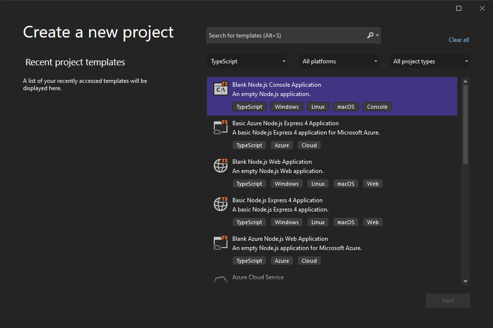
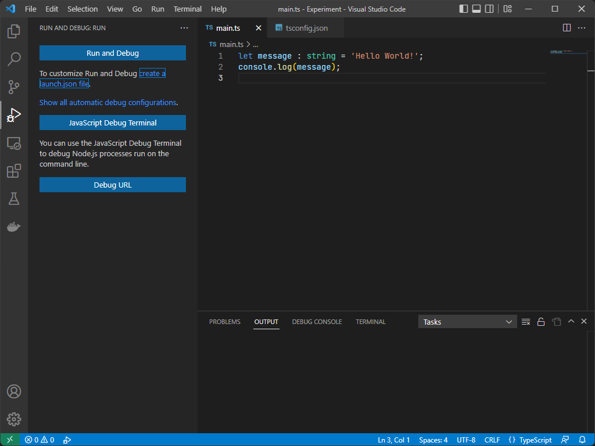
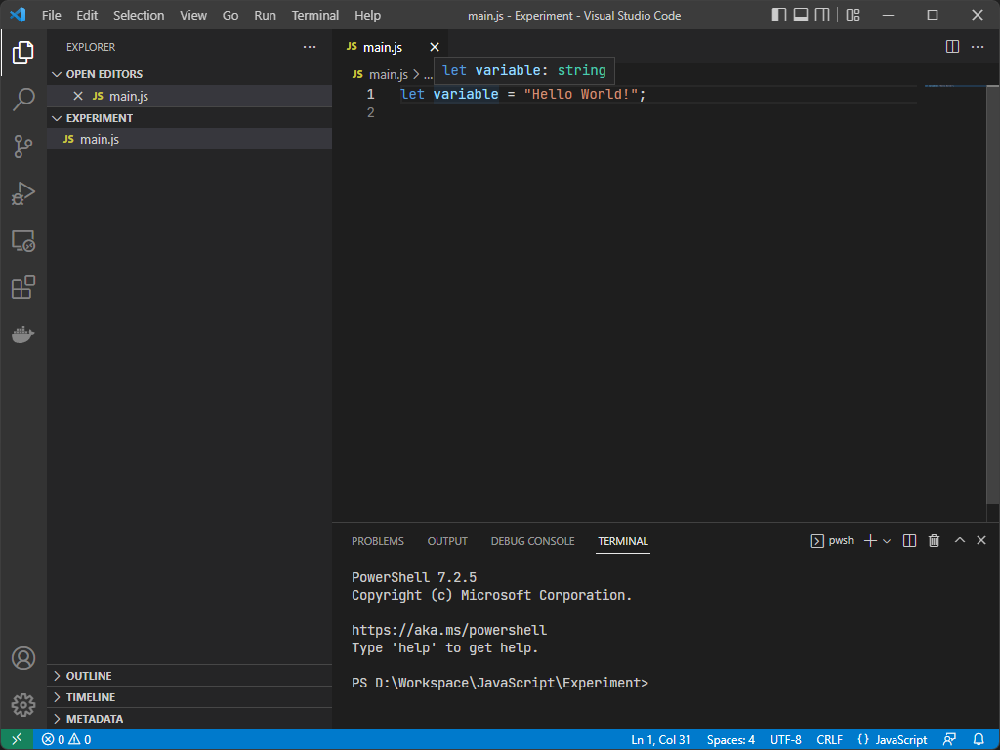

# 타입스크립트
[타입스크립트](https://ko.wikipedia.org/wiki/타입스크립트)(TypeScript)는 마이크로소프트에서 개발한 [자바스크립트](ko.JavaScript.md) ECMAScript 2015의 상위 프로그래밍 언어이다. 자바스크립트는 런타임 도중에 자료형 검사 및 오류 검증 등을 처리하는 [동적 프로그래밍 언어](https://ko.wikipedia.org/wiki/동적_프로그래밍_언어)이지만, 여기에 [정적 프로그램 분석](https://ko.wikipedia.org/wiki/정적_프로그램_분석)을 제공하는 게 타입스크립트의 설계 목적이다. 자바스크립트와 엄청난 호환성을 자랑하여 함께 병행되어 사용되는 경우를 쉽게 찾아볼 수 있다.

## 컴파일러
자바스크립트와 달리, 타입스크립트는 [컴파일 언어](Programming.md#컴파일러)(compiled language)이지만 [기계어](https://ko.wikipedia.org/wiki/기계어)가 아닌 자바스크립트 언어로 변환한다. 타입스크립트 컴파일러 `tsc`는 npm로부터 사용되기 때문에 반드시 [Node.js](ko.JavaScript.md#nodejs)이 먼저 설치되어야 한다.

### 비주얼 스튜디오
비주얼 스튜디오에서는 타입스크립트 프로젝트 생성을 지원하며, 그 안에는 이미 컴파일러와 같은 필요한 패키지들이 로컬 경로에 들어있는 것을 확인할 수 있다.



### 비주얼 스튜디오 코드
타입스크립트 컴파일러 `tsc`는 아래의 명령어로 직접 npm [패키지](https://www.npmjs.com/package/typescript)를 설치해야 한다. 만일 컴파일러를 시스템 전역에 일괄적으로 사용하려면 `--location=global` 옵션을 추가한다.

```terminal
npm install typescript
```

VS Code에서 타입스크립트를 작업하면 `tsconfig.json`이란 파일로부터 컴파일러 옵션과 같이 빌드에 적용되는 프로젝트 환경설정이 들어있다. 커맨드(`F1` 혹은 `Shift+Ctrl+P`)에서 `TypeScript: Go to Project Configuration`을 선택하여 해당 파일을 생성 및 확인할 수 있다.

`tsconfig.json` 환경설정에서 제공하는 컴파일러 옵션으로 타입스크립트를 자바스크립트로 빌드할 수 있다. 이를 위해 커맨드에서 `Tasks: Run Build Task` 혹은 `Shirt+Ctrl+B` 단축키를 누른 다음 빌드 작업을 `tsc: build - tsconfig.json`으로 선택한다. 만일 이러한 절차가 번거로우면 커맨드의 `Tasks: Configure Default Build Task`에서 기본 빌드 작업으로 지정할 수 있다.

> 그 외의 `tsc: watch - tsconfig.json` 선택지는 [`--watch`](https://www.npmjs.com/package/tsc-watch) 옵션이 추가된 것으로, 컴파일 상태를 관측 및 적절한 반응을 취할 수 있도록 타입스크립트 개발에 편의성을 제공한다.

위의 과정으로 타입스크립트의 빌드 환경설정을 구성하여도, 빌드로부터 생성된 자바스크립트를 디버깅(`Ctrl+F5`) 혹은 실행(`F5`)을 설정하는데 사용되는 `launch.json` 파일은 VS Code의 좌측 탭의 "Run and Debug" 혹은 단축키 `Shift+Ctrl+D`를 누르면 나타나는 "create a launch.json file" 링크를 클릭하여 생성할 수 있다. 이때 자바스크립트를 실행할 디버거를 Node.js으로 선택한다.



프로그램 실행 (혹은 디버깅)을 한다고 해서 빌드가 함께 되는 것이 아니다. 이 두 절차를 연동시키기 위해 `launch.json` 안에 `"preLaunchTask": "tsc: build - tsconfig.json"`을 추가한다. 그러면 프로그램 실행 (혹은 디버깅) 전에 타입스크립트 컴파일이 우선 진행되어 타입스크립트를 Node.js이 처리할 수 있는 자바스크립트로 변환시킨다.

# 기초
> *참조: [TypeScript: Documentation - TypeScript for JavaScript Programmers](https://www.typescriptlang.org/docs/handbook/typescript-in-5-minutes.html)*

타입스크립트는 일명 "자료형 [구문](https://ko.wikipedia.org/wiki/구문_(프로그래밍_언어))이 지원되는 [자바스크립트](ko.JavaScript.md)"이다. 자바스크립트 지식이 타입스크립트에 그대로 적용된다는 의미인데, 실제로 타입스크립트 파일에 순수 자바스크립트 코드를 작성하면 별도의 컴파일 작업이 필요없이 곧바로 실행이 가능하다. 그러므로 타입스크립트를 배우기 위해서는 반드시 자바스크립트를 숙지해야 한다. 본 장에서는 타입스크립트만이 갖는 기초적인 특성들을 소개한다.

## 자료형 추론
[자료형 추론](https://en.wikipedia.org/wiki/Type_inference)(type inference)이란, 프로그래밍 언어의 표현식으로부터 [자료형](/docs/ko.JavaScript#자료형)을 자동으로 감지하는 기능이며 타입스크립트의 핵심이다. 타입스크립트는 자바스크립트 코드에 추가사항 필요 없이도 추론을 통해 어떠한 자료형에 해당하는지 명시할 수 있다. 아래의 이미지는 타입스크립트 기반의 VS Code 편집기에서 작업하는 자바스크립트 파일에 타입스크립트에서 제공하는 자료형 추론을 보여준다.



> 자바스크립트에는 `: <type>`이란 자료형 주석(type annotation) 구문이 존재하지 않으며, 추론된 표현식을 자바스크립트에 입력하면 유효하지 않은 구문으로 실행되지 않는다.
