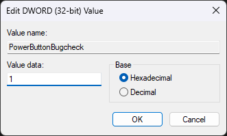
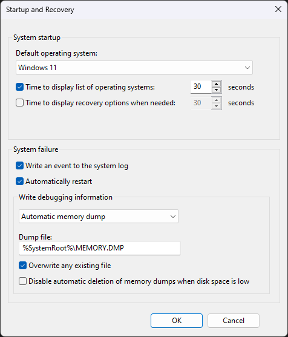

# 블루스크린
](./images/bsod_bugcheck_d1.png)

[블루스크린](https://ko.wikipedia.org/wiki/블루스크린), 일명 BSOD(Blue Screen of Death; 죽음의 파란 화면)는 시스템을 망가뜨릴 수 있는 손상이 가해지는 것을 방지하기 위한 화면이며, 블루스크린 원인을 알려주는 [버그 확인 코드](#버그-확인-코드)를 표시하고 분석에 필요한 [메모리 덤프](ko.Dump.md#커널-모드-덤프) 파일을 생성한다. 시스템은 아래의 사유가 발생하면 블루스크린이 나타난다.

> [윈도우 참가자 프로그램](https://support.microsoft.com/en-us/windows/windows-참가자-프로그램에-참여하기-ef20bb3d-40f4-20cc-ba3c-a72c844b563c)(Windows Insider Program)을 통해 사용할 수 있는 Preview 버전의 윈도우 운영체제는 "초록색" 블루스크린이 나타난다.

* **시스템 충돌**: 운영체제 커널상 처리되지 않은 [오류](https://ko.wikipedia.org/wiki/예외_처리), 일명 커널 모드 충돌이다 (예시. [0x19 BAD_POOL_HEADER](https://learn.microsoft.com/en-us/windows-hardware/drivers/debugger/bug-check-0x19--bad-pool-header)).
* **유효하지 않은 동작**: 운영체제가 본래 설계에 벗어난 동작을 하였을 때, 복구가 불가하다고 판정되면 커널 초기화를 명분으로 발생한다 (예시. [0x133 DPC_WATCHDOG_VIOLATION](https://learn.microsoft.com/en-us/windows-hardware/drivers/debugger/bug-check-0x133-dpc-watchdog-violation)).

## 버그 확인 코드
버그 확인(bug check) 혹은 중지 오류(stop error) 코드는 블루스크린이 발생한 원인을 설명하는 운영체제 오류 번호이다. [`KeBugCheck()`](https://learn.microsoft.com/en-us/windows-hardware/drivers/ddi/ntddk/nf-ntddk-kebugcheck) 매개변수 또는 [`KeBugCheckEx()`](https://learn.microsoft.com/en-us/windows-hardware/drivers/ddi/wdm/nf-wdm-kebugcheckex) 첫 번째 매개변수 `BugCheckCode` 명칭에서 유래된 용어이며, 여기로 전달되는 인자가 바로 버그 확인 코드이다. 특히 `KeBugCheckEx()` 루틴은 추가 매개변수 네 개가 있어 오류에 대한 구체적인 정보를 제공한다.

> 버그 확인 코드는 매우 다양하기 때문에, [참조 문서](https://learn.microsoft.com/en-us/windows-hardware/drivers/debugger/bug-check-code-reference2)로부터 정확한 블루스크린 발생 경위를 파악하고 [근본 원인 분석](https://en.wikipedia.org/wiki/Root_cause_analysis)(root cause analysis; RCA)을 진행한다.

다음은 상기 블루스크린으로부터 생성된 덤프 파일을 확인한 내용이며, 버그 확인 코드 아래에 표시된 네 개의 전달인자로부터 문제가 발생한 메모리 주소 등의 시스템 충돌 관련 정보를 알 수 있다.

 덤프 분석 내용](./images/windbg_bugcheck_d1.png)

## 강제 시스템 충돌
간혹 시스템이 아무런 반응이 없는 [프리징](https://ko.wikipedia.org/wiki/프리징_(컴퓨팅)) 상태에 걸리면, 해당 증상의 원인 분석에 필요한 덤프 파일을 생성하기 위해 블루스크린이 강요된다. 다음은 블루스크린을 강제로 발생기키는 방법을 소개한다.

* **NMI**

    [마스크 불가능 인터럽트](https://en.wikipedia.org/wiki/Non-maskable_interrupt)(Non-maskable Interrupt; NMI)는 가장 최우선적으로 처리되어 시스템이 절대 무시할 수 없는 [인터럽트](ko.Processor.md#인터럽트) 신호이다. 흔히 서버용 PC는 NMI 버튼이 존재하여, 누를 시 버그 확인 코드 [0x80 NMI_HARDWARE_FAILURE](https://learn.microsoft.com/en-us/windows-hardware/drivers/debugger/bug-check-0x80--nmi-hardware-failure)가 발생한다. 블루스크린을 일으키기에 가장 확실한 방법이지만, 일반적으로 [PowerEdge R720](https://www.dell.com/support/manuals/ko-kr/poweredge-r720/720720xdom-v3/전면-패널-구조-및-표시등?guid=guid-23ecb1eb-0086-4839-80a9-9f5f3e679dbf)과 같은 서버용 컴퓨터에서 트러블슈팅 용도로 존재한다.

    * **Debug-VM**

        [`Debug-VM`](https://learn.microsoft.com/en-us/powershell/module/hyper-v/debug-vm) 파워셸 명령어는 마이크로소프트에서 개발한 [하이퍼바이저](https://ko.wikipedia.org/wiki/하이퍼바이저), 즉 [하이퍼-V](https://ko.wikipedia.org/wiki/하이퍼-V)(Hyper-V) 호스트로부터 가상 머신에 NMI 신호를 전송하여 블루스크린을 유발할 수 있다. 파워셸은 관리자 권한으로 실행되어야 하며, 가상 머신의 이름은 [`Get-VM`](https://learn.microsoft.com/en-us/powershell/module/hyper-v/get-vm) 명령어로 확인이 가능하다.
    
        ```powershell
      Debug-VM -Name "<VM name>" -InjectNonMaskableInterrupt
        ```

* **키보드**

    키보드로부터 커널에 `KeBugCheck()` 루틴을 호출하므로써 윈도우 운영체제에 버그 확인 코드 [0xE2 MANUALLY_INITIATED_CRASH](https://learn.microsoft.com/en-us/windows-hardware/drivers/debugger/bug-check-0xe2--manually-initiated-crash)를 발생시키는 방법이다. [PS/2](https://ko.wikipedia.org/wiki/PS/2_단자) 혹은 [USB](https://ko.wikipedia.org/wiki/USB) 신호로 동작하는 키보드로 일으킨 강제 블루스크린을 설정하는 방법은 아래의 둘 중 오로지 하나만이 적용되며 재부팅이 요구된다.

    > 하이퍼-V 행은 PS/2 또는 USB 키보드 무관하게 하이퍼-V 가상 머신에서 키보드로 강제 BSOD를 일으키기 위해 필요한 레지스트리이다.

    1. **`CTRL+SCROLL` 단축키**

        우측 `CTRL`를 누르는 동시에 `SCROLL LOCK` 키를 두 번 클릭하여 시스템 충돌을 발생시키려면 사용하고 있는 키보드에 따라 지정된 레지스트리 키로 이동한 다음, 아래와 같이 `CrashOnCtrlScroll`이란 새로운 DWORD (32-bit) 레지스트리 값을 생성한다.

        <table style="width: 80%; margin: auto;"><caption style="caption-side: top;"><code>CTRL+SCROLL</code> 단축키 강제 블루스크린 설정</caption><colgroup><col style="width: 20%;"/><col style="width: 80%;"/></colgroup><thead><tr><th style="text-align: center;">키보드</th><th style="text-align: center;">레지스트리 키</th></tr></thead><tbody><tr><td style="text-align: center;">PS/2</td><td><code>HKLM\SYSTEM\CurrentControlSet\Services\i8042prt\Parameters</code></td></tr><tr><td style="text-align: center;">USB</td><td><code>HKLM\SYSTEM\CurrentControlSet\Services\kbdhid\Parameters</code></td></tr><tr><td style="text-align: center;">하이퍼-V</td><td><code>HKLM\SYSTEM\CurrentControlSet\Services\hyperkbd\Parameters</code></td></tr></tbody></table>

        

    2. **대안 키보드 단축키**

        현재 대부분의 키보드는 `SCROLL LOCK` 키가 없어 블루스크린을 강제할 대안의 단축키가 필요하다. 만일 `CrashOnCtrlScroll` 레지스트리 값이 이미 존재하면 대안 단축키가 인식되지 않으므로 삭제하도록 한다. 사용하고 있는 키보드에 따라 아래 레지스트리 키로 이동한 다음, 아래와 같이 두 DWORD (32-bit) 레지스트리 값을 생성한다.

        <table style="width: 80%; margin: auto;"><caption style="caption-side: top;">대안 키보드 단축키 강제 블루스크린 설정</caption><colgroup><col style="width: 20%;"/><col style="width: 80%;"/></colgroup><thead><tr><th style="text-align: center;">키보드</th><th style="text-align: center;">레지스트리 키</th></tr></thead><tbody><tr><td style="text-align: center;">PS/2</td><td><code>HKLM\SYSTEM\CurrentControlSet\Services\i8042prt\crashdump</code></td></tr><tr><td style="text-align: center;">USB</td><td><code>HKLM\SYSTEM\CurrentControlSet\Services\kbdhid\crashdump</code></td></tr><tr><td style="text-align: center;">하이퍼-V</td><td><code>HKLM\SYSTEM\CurrentControlSet\Services\hyperkbd\crashdump</code></td></tr></tbody></table>

        * `Dump1Keys`: 첫 번째 단축키 조합으로 좌측/우측 `SHIFT`, `CTRL`, 혹은 `ALT` 키 중 택한다.
        * `Dump2Key`: 두 번째 단축키 조합으로 두 번 클릭할 버튼을 지정한다. 레지스트리 값에 들어갈 데이터로 배열에 기입된 키보드 스캔 코드의 인덱스를 입력한다.

            ```c
          const UCHAR keyToScanTbl[134] = {
              0x00,0x29,0x02,0x03,0x04,0x05,0x06,0x07,0x08,0x09,
              0x0A,0x0B,0x0C,0x0D,0x7D,0x0E,0x0F,0x10,0x11,0x12,
              0x13,0x14,0x15,0x16,0x17,0x18,0x19,0x1A,0x1B,0x00,
              0x3A,0x1E,0x1F,0x20,0x21,0x22,0x23,0x24,0x25,0x26,
              0x27,0x28,0x2B,0x1C,0x2A,0x00,0x2C,0x2D,0x2E,0x2F,
              0x30,0x31,0x32,0x33,0x34,0x35,0x73,0x36,0x1D,0x00,
              0x38,0x39,0xB8,0x00,0x9D,0x00,0x00,0x00,0x00,0x00,
              0x00,0x00,0x00,0x00,0x00,0xD2,0xD3,0x00,0x00,0xCB,
              0xC7,0xCF,0x00,0xC8,0xD0,0xC9,0xD1,0x00,0x00,0xCD,
              0x45,0x47,0x4B,0x4F,0x00,0xB5,0x48,0x4C,0x50,0x52,
              0x37,0x49,0x4D,0x51,0x53,0x4A,0x4E,0x00,0x9C,0x00,
              0x01,0x00,0x3B,0x3C,0x3D,0x3E,0x3F,0x40,0x41,0x42,
              0x43,0x44,0x57,0x58,0x00,0x46,0x00,0x00,0x00,0x00,
              0x00,0x7B,0x79,0x70 };
            ```

    키보드로 블루스크린이 강제되지 않은 경우가 있으며, 이는 키보드보다 높은 [IRQL](ko.Processor.md#IRQL)에 의한 시스템 장애를 겪고 있음을 시사한다. 다시 말해, IRQL이 상대적으로 낮은 USB 키보드는 일부 시스템 프리징 증상에서 BSOD를 일으킬 수 없으므로 PS/2 키보드를 사용하기를 권장한다.

* **전원 버튼**

    전원 버튼으로 블루스크린을 발생키려면 반드시 하드웨어, 펌웨어, 그리고 운영체제 요건이 충족되어야 한다:

    1. [GPIO](https://ko.wikipedia.org/wiki/GPIO) 기반의 전원 버튼
    2. 전원 이벤트를 Windows Power Manager로 전달하는 펌웨어
    3. [윈도우 10](https://ko.wikipedia.org/wiki/윈도우_10) ([버전 1809](https://ko.wikipedia.org/wiki/윈도우_10#레드스톤_5)) 혹은 [윈도우 서버 2019](https://ko.wikipedia.org/wiki/윈도우_서버_2019) 이상의 운영체제

    위의 요건을 모두 충족한다면 아래의 레지스트리 키로 이동하여 `PowerButtonBugcheck`이란 새로운 DWORD (32-bit) 값을 생성한다.
    
    ```terminal
  HKLM\SYSTEM\CurrentControlSet\Control\Power
    ```

    
    
    전원 버튼을 7초 동안 누르고 있으면 버그 확인 코드 [0x1C8 MANUALLY_INITIATED_POWER_BUTTON_HOLD](https://learn.microsoft.com/en-us/windows-hardware/drivers/debugger/bug-check-0x1c8--manually-initiated-power-button-hold)가 반환되지만, 10초 이상 누르면 UEFI 재설정이 되므로 그 전에 전원 버튼에 손을 떼도록 한다. 해당 레지스트리 값을 새로 생성해야 한다면 재부팅이 필요할 수 있다.

* **[WinDbg](ko.WinDbg.md)**

    [윈도우 NT](ko.WindowsNT.md) 운영체제를 [디버깅](https://ko.wikipedia.org/wiki/디버그)하는 프로그램으로 커널 모드에서 [`.crash`](https://learn.microsoft.com/en-us/windows-hardware/drivers/debugger/-crash--force-system-crash-) 명령어를 입력하여 시스템 강제 충돌을 일으킬 수 있다. `KeBugCheck()` 루틴으로부터 버그 확인 코드 0xE2 MANUALLY_INITIATED_CRASH가 반환되는데, 만일 시스템 충돌이 발생하지 않으면 중단점 탈출을 시도한다.

* **[NotMyFault](ko.NotMyFault.md)**

    [Sysinternals](ko.Sysinternals.md) 유틸리티 중에서 몇 가지 방식으로 시스템 충돌을 일으킬 수 있는 프로그램이다. 비록 시스템 응답이 없는 상태에서 적합하지 않으나, 일반적인 상황에서 BSOD를 일으킬 때는 유용하다.

# BSOD 덤프 설정
시스템 충돌로 BSOD가 나타나면 [자동 메모리 덤프](ko.Dump.md#자동-메모리-덤프)(혹은 [커널 메모리 덤프](ko.Dump.md#커널-메모리-덤프))를 생성하고 재부팅을 하는 게 기본 동작이다. 상황에 따라 덤프 유형이나 BSOD 동작을 달리 설정해야 하는 경우가 생긴다. 해당 설정은 아래의 레지스트리 키에서 변경이 가능하며, 적용을 하기 위해서는 반드시 재부팅이 필요하다.

```terminal
HKLM\SYSTEM\CurrentControlSet\Control\CrashControl
```

해당 레지스트리 키에서 설정할 수 있는 값들은 다음과 같다:

### `CrashControl`: 메모리 덤프
커널, 전체, 그리고 활성 메모리 덤프와 관련된 설정이다.

<table style="width: 95%; margin: auto;">
<caption style="caption-side: top;"><code>CrashControl</code> 레지스트리: 메모리 덤프</caption>
<colgroup><col style="width: 25%;"/><col style="width: 15%;"/><col style="width: 60%;"/></colgroup>
<thead><tr><th style="text-align: center;">레지스트리 값</th><th style="text-align: center;">종류</th><th style="text-align: center;">설명</th></tr></thead>
<tbody><tr>
<td><code>AlwaysKeepMemoryDump</code></td><td style="text-align: center;">REG_DWORD</td><td>드라이브 여유 공간이 25 GB 미만이어도 메모리 덤프를 유지한다(반면, 삭제될 시 이벤트 ID 1008 기록).<br/><ul><li>0x0: 비활성</li><li>0x1: 활성</li></ul></td>
</tr><tr>
<td><code>CrashDumpEnabled</code></td><td style="text-align: center;">REG_DWORD</td><td>메모리 덤프 유형을 선택한다.<br/><ul><li>0x0: (없음)</li><li>0x1: <a href="ko.Dump.md#전체-메모리-덤프">전체 메모리 덤프</a> <i>혹은</i> <a href="ko.Dump.md#활성-메모리-덤프">활성 메모리 덤프</a></li><li>0x2: <a href="ko.Dump.md#커널-메모리-덤프">커널 메모리 덤프</a></li><li>0x3: <a href="ko.Dump.md#작은-메모리-덤프">작은 메모리 덤프</a></li><li>0x7: <a href="ko.Dump.md#자동-메모리-덤프">자동 메모리 덤프</a></li></ul></td>
</tr><tr>
<td><code>DumpFile</code></td><td style="text-align: center;">REG_EXPAND_SZ</td><td>메모리 덤프 파일의 경로 및 이름을 지정한다(기본값: <code>%SystemRoot%\MEMORY.DMP</code>).</td>
</tr><tr>
<td><code>DumpFilters</code></td><td style="text-align: center;">REG_MULTI_SZ</td><td>페이징 파일로 덤프를 수집하기 위해 필요한 필터 드라이버의 목록이다.<br/><ul><li><code>dumpfve.sys</code>: BitLocker Drive Encryption Crashdump Filter Driver</li></ul></td>
</tr><tr>
<td><code>FilterPages</code></td><td style="text-align: center;">REG_DWORD</td><td>트러블슈팅에 불필요한 페이지를 메모리 덤프에서 제외시킨다.<br/><ul><li>0x0: 비활성</li><li>0x1: 활성 (활성 메모리 덤프를 위한 필요 조건)</li></ul></td>
</tr><tr>
<td><code>Overwrite</code></td><td style="text-align: center;">REG_DWORD</td><td>기존의 메모리 덤프를 덮어씌운다.<br/><ul><li>0x0: 비활성</li><li>0x1: 활성</li></ul></td>
</tr><tr>
<td><code>PageFileTooSmall</code></td><td style="text-align: center;">REG_QWORD</td><td>페이징 파일 크기 부족으로 덤프 수집을 실패할 시 생성된다.</td>
</tr></tbody>
</table>

### `CrashControl`: 작은 메모리 덤프
본 레지스트리 값은 작은 메모리 덤프와 관련된 설정이다.

<table style="width: 95%; margin: auto;">
<caption style="caption-side: top;"><code>CrashControl</code> 레지스트리: 작은 메모리 덤프</caption>
<colgroup><col style="width: 25%;"/><col style="width: 15%;"/><col style="width: 60%;"/></colgroup>
<thead><tr><th style="text-align: center;">레지스트리 값</th><th style="text-align: center;">종류</th><th style="text-align: center;">설명</th></tr></thead>
<tbody><tr>
<td><code>MinidumpDir</code></td><td style="text-align: center;">REG_EXPAND_SZ</td><td>작은 메모리 덤프를 저장할 경로를 지정한다(기본값: <code>%SystemRoot%\Minidump</code>)</td>
</tr><tr>
<td><code>MinidumpsCount</code></td><td style="text-align: center;">REG_DWORD</td><td>지정된 경로에 저장될 수 있는 작은 메모리 덤프의 최대 개수이다.</td>
</tr></tbody>
</table>

### `CrashControl`: 덤프 로그
덤프 수집에 대한 정보를 담고 있는 `DumpStack.log`를 설정한다.

<table style="width: 95%; margin: auto;">
<caption style="caption-side: top;"><code>CrashControl</code> 레지스트리: 덤프 로그</caption>
<colgroup><col style="width: 25%;"/><col style="width: 15%;"/><col style="width: 60%;"/></colgroup>
<thead><tr><th style="text-align: center;">레지스트리 값</th><th style="text-align: center;">종류</th><th style="text-align: center;">설명</th></tr></thead>
<tbody><tr>
<td><code>DumpLogLevel</code></td><td style="text-align: center;">REG_DWORD</td><td><code>DumpStack.log</code> 활성 시, 덤프 수집에 대한 성능 수치를 함께 기록한다.<br/><ul><li>0x0: 비활성</li><li>0x1: 활성</li></ul></td>
</tr><tr>
<td><code>EnableLogFile</code></td><td style="text-align: center;">REG_DWORD</td><td>덤프 수집 과정에서 <code>DumpStack.log</code> 로그 파일을 생성한다.<br/><ul><li>0x0: 비활성</li><li>0x1: 활성</li></ul></td>
</tr></tbody>
</table>

### `CrashControl`: 블루스크린
시스템 충돌로 블루스크린이 나타날 때의 동작을 설정한다.

<table style="width: 95%; margin: auto;">
<caption style="caption-side: top;"><code>CrashControl</code> 레지스트리: 블루스크린</caption>
<colgroup><col style="width: 25%;"/><col style="width: 15%;"/><col style="width: 60%;"/></colgroup>
<thead><tr><th style="text-align: center;">레지스트리 값</th><th style="text-align: center;">종류</th><th style="text-align: center;">설명</th></tr></thead>
<tbody><tr>
<td><code>AutoReboot</code></td><td style="text-align: center;">REG_DWORD</td><td>덤프 수집이 100% 완료되면 시스템 재부팅을 자동으로 실행한다.<br/><ul><li>0x0: 비활성</li><li>0x1: 활성</li></ul></td>
</tr><tr>
<td><code>DisplayParameters</code></td><td style="text-align: center;">REG_DWORD</td><td>BSOD 좌측 상단에 네 개의 <code>KeBugcheckEx()</code> 매개변수를 표시한다.<br/><ul><li>0x0: 비활성</li><li>0x1: 활성</li></ul></td>
</tr><tr>
<td><code>DisableEmoticon</code></td><td style="text-align: center;">REG_DWORD</td><td>BSOD에서 <code>:(</code> 이모티콘을 표시하지 않는다.<br/><ul><li>0x0: 비활성</li><li>0x1: 활성</li></ul></td>
</tr><tr>
<td><code>LogEvent</code></td><td style="text-align: center;">REG_DWORD</td><td>BSOD가 발생하면 이벤트 ID 1001 BugCheck를 기록한다.<br/><ul><li>0x0: 비활성</li><li>0x1: 활성</li></ul></td>
</tr></tbody>
</table>

### `CrashControl`: 전용 덤프
전용 덤프(dedicated dump)는 가상 메모리로 사용이 불가한, 오로지 덤프 수집만을 위해 존재하는 페이징 파일을 가리킨다. 윈도우 7 이전까지만 해도 OS 드라이브에 용량이 부족할 시, 타 드라이브에 메모리 덤프를 수집하려면 전용 덤프가 유일한 방법이었다. 비록 전용 덤프의 활용도가 축소되었으나, 아래의 두 가지 특징을 지닌다.

1. 페이징 파일이 존재하여도 메모리 덤프를 수집할 때에는 전용 덤프가 사용된다.
2. 전용 덤프를 구성할 디스크 용량이 부족하면 아예 반영이 되지 않는다.

다음은 전용 덤프를 설정하기 위해 필요한 레지스트리 값이다.

<table style="width: 95%; margin: auto;">
<caption style="caption-side: top;"><code>CrashControl</code> 레지스트리: 전용 덤프</caption>
<colgroup><col style="width: 25%;"/><col style="width: 15%;"/><col style="width: 60%;"/></colgroup>
<thead><tr><th style="text-align: center;">레지스트리 값</th><th style="text-align: center;">종류</th><th style="text-align: center;">설명</th></tr></thead>
<tbody><tr>
<td><code>DedicatedDumpFile</code></td><td style="text-align: center;">REG_SZ</td><td>덤프 전용의 페이징 파일 경로 및 이름을 지정한다.</td>
</tr><tr>
<td><code>DumpFileSize</code></td><td style="text-align: center;">REG_DWORD</td><td>덤프 전용의 페이징 파일 크기를 <a href="https://ko.wikipedia.org/wiki/메가바이트">MB</a> 단위로 지정한다.<br/><ul><li>0x0: 시스템이 관리하는 크기 (기본값)</li></ul></td>
</tr></tbody>
</table>

> 저장될 덤프 파일의 경로 및 이름은 `DumpFile` 레지스트리 값을 그대로 사용한다.

## 시작 및 복구
만일 아래 그림과 같이 GUI 창으로 BSOD 유형 및 동작을 설정하려면 View advanced system settings 검색 (혹은 `systempropertiesadvanced.exe` 실행) 이후, "시작 및 복구(Startup and Recovery)" 그룹 내의 설정 버튼을 클릭한다. 허나, 레지스트리 편집기에 비해 설정할 수 있는 항목이 제한적인 단점을 지닌다.



# 참조
* [Forcing a System Crash from the Keyboard - Windows dirvers &#124; Microsoft Learn](https://learn.microsoft.com/en-us/windows-hardware/drivers/debugger/forcing-a-system-crash-from-the-keyboard)
* [Forcing a System Crash from the Debugger - Windows drivers &#124; Microsoft Learn](https://learn.microsoft.com/en-us/windows-hardware/drivers/debugger/forcing-a-system-crash-from-the-debugger)
* [Forcing a System Crash with the Power Button - Windows drivers &#124; Microsoft Learn](https://learn.microsoft.com/en-us/windows-hardware/drivers/debugger/forcing-a-system-crash-with-the-power-button)
