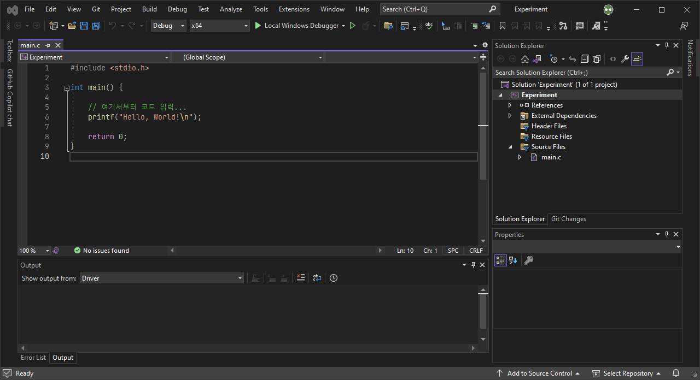

# C
> *참조: [Microsoft Docs C 언어 설명서](https://learn.microsoft.com/en-us/cpp/c-language/)*

C 언어는 [유닉스](https://ko.wikipedia.org/wiki/유닉스)(UNIX) 컴퓨터를 위한 소프트웨어 제작을 위해 개발된 [B](https://ko.wikipedia.org/wiki/B_(프로그래밍_언어)) 언어의 후속작이다. 현재 C 언어는 가장 널리 사용되고 있는 프로그래밍 언어로 [C++](ko.Cpp.md), [C#](ko.Csharp.md), [파이썬](ko.Python.md), 자바 등 여러 프로그래밍 언어에 영향을 주었다. C 언어는 다른 프로그래밍 언어에 비해 매우 빠른 처리 속도와 훌륭한 호환성을 가지고 있어 소프트웨어 및 펌웨어 개발에 여전히 사용되고 있다.

## 컴파일러
C 프로그래밍 언어는 [컴파일 언어](ko.Compiler.md)(compiled language)이다. C 컴파일러는 [국제 표준화 기구](https://www.iso.org/home.html)(International Organization for Standardization; ISO)에서 표준을 발표한 년도에 따라 버전이 나뉘어진다. 가장 널리 사용되고 있는 버전으로는 ANSI C(일명 C89)와 C99가 있다. 본 문서는 <span style="color: red;">*ANSI C 컴파일러 기준*</span>으로 C 프로그래밍 언어를 설명한다.

컴파일러는 개발사와 목적에 따라 다양한 종류가 존재하지만, 전부 동일한 ISO 표준에 따라 동작하므로 일반적인 경우에는 어떤 컴파일러를 사용하던 무관하다. 아래는 대표적인 C 언어 컴파일러들을 나열한다.

* [Microsoft Visual C++](https://ko.wikipedia.org/wiki/마이크로소프트_비주얼_C%2B%2B) (일명 MSVC): 마이크로소프트
* [GNU C Compiler](https://ko.wikipedia.org/wiki/GNU_C_컴파일러) (일명 GCC): GNU 프로젝트
* [Clang](https://ko.wikipedia.org/wiki/클랭): LLVM Developer Group, 애플

## 설치
C 프로그래밍 언어에 필요한 컴파일러는 흔히 소스 코드 편집, 프로그램 빌드, 그리고 디버깅 기능을 제공하는 [통합 개발 환경](https://ko.wikipedia.org/wiki/통합_개발_환경)(integrated development environment; IDE)을 설치하면 대체로 권장되는 컴파일러가 함께 설치된다.

* 비주얼 스튜디오 <sub>(윈도우, macOS)</sub>
* 엑스코드 <sub>(macOS)</sub>
* [CLion](https://www.jetbrains.com/clion/) <sub>(윈도우, macOS, 리눅스)</sub>

> [비주얼 스튜디오 코드]()(Visual Studio Code; VS Code)는 엄연히 말해 IDE가 아닌 "텍스트 편집기" 프로그램이다. 외부 컴파일러를 불러올 수 있지만 과정이 복잡하여 가능하면 위의 IDE 중 하나를 사용하는 걸 권장한다.

## 프로젝트
다음은 비주얼 스튜디오 2022을 위주로 C 언어 프로젝트 구축에 대하여 설명한다.



엑스코드와 달리, 비주얼 스튜디오는 C 언어를 위한 별도 프로젝트 생성 옵션이 존재하지 않는다. 대안으로 [C++](ko.Cpp.md)에서 빈 프로젝트(Empty Project)를 생성한 다음, 소스 코드를 `.C` 확장자로 직접 추가할 수 있다. MSVC 컴파일러는 C++를 주요 대상으로 설계된 컴파일러이지만, C 언어도 함께 지원하기 때문이다.

아래는 C 언어를 실행하는 가장 기초적인 코드와 함께 코드에 대한 설명이다.

<table style="width: 95%; margin: auto;">
<caption style="caption-side: top;">간단한 C 언어 코드 및 설명</caption>
<colgroup><col style="width: 50%;"/><col styl="width: 50%;"/></colgroup>
<thead><tr><th style="text-align: center;">코드</th><th style="text-align: center;">설명</th></tr></thead>
<tbody>
<tr>
<td>

```c
#include <stdio.h>

int main() {

    // 여기서부터 코드 입력...
    printf("Hello, World!\n");

    return 0;
}
```
</td><td>
<ul><li><code>#include &lt;stdio.h&gt;</code><br/>C 표준 입출력 라이브러리를 불러오며, 터미널에 텍스트를 출력하는 `printf()` <a href="#함수">함수</a>를 제공한다.</li><li><code>int main() { ... }</code><br/>C 언어가 시작되는 함수, 일명 <a href="#진입점">진입점</a>이다.</li><li><code>return 0</code><br/>함수를 종료하며 0 값을 반환하는 데, 이는 <code>EXIT_SUCCESS</code>에 대응하며 성공적으로 프로그램이 종료되었음을 의미한다.</li></ul>
</td></tr></tbody>
</table>

### C 런타임 라이브러리
> *출처: [Security Features in the CRT | Microsoft Learn](https://learn.microsoft.com/en-us/cpp/c-runtime-library/security-features-in-the-crt)*

C [런타임 라이브러리](https://ko.wikipedia.org/wiki/런타임_라이브러리), 일명 CRT는 C/C++ 프로그램에 저급 시스템 서비스와 기능성을 제공하는 함수 및 라이브러리의 집합체이다. 대표적으로 메모리 할당 및 해제, 파일 입출력, 문자열 조작, 예외 처리 등이 해당한다. 매우 기초적이지만 필연적인 기능이므로, 일부 핵심 CRT(예를 들어 `malloc`, `printf`, `strcpy` 등)는 운영체제가 설치될 때 함께 내장되기도 한다.

비주얼 스튜디오 2015 이후부터 `_s` 접미사가 붙은 안정성이 강화된 새로운 CRT 함수들이 소개되며(예를 들어 [`printf_s`](https://learn.microsoft.com/en-us/cpp/c-runtime-library/reference/printf-s-printf-s-l-wprintf-s-wprintf-s-l), [`strcpy_s`](https://learn.microsoft.com/en-us/cpp/c-runtime-library/reference/strcpy-s-wcscpy-s-mbscpy-s) 등), 기존의 옛 CRT 함수들을 사용하려 할 시 [C4996](https://learn.microsoft.com/en-us/cpp/error-messages/compiler-warnings/compiler-warning-level-3-c4996) 컴파일러 경고가 나타난다. 하지만 옛 CRT의 활용이 권장되지 않을 뿐, 사라진 게 아니므로 경고를 무시하려면 아래와 같이 매크로를 소스 코드 또는 프로젝트에 정의한다.

```c
#define _CRT_SECURE_NO_WARNINGS
```


