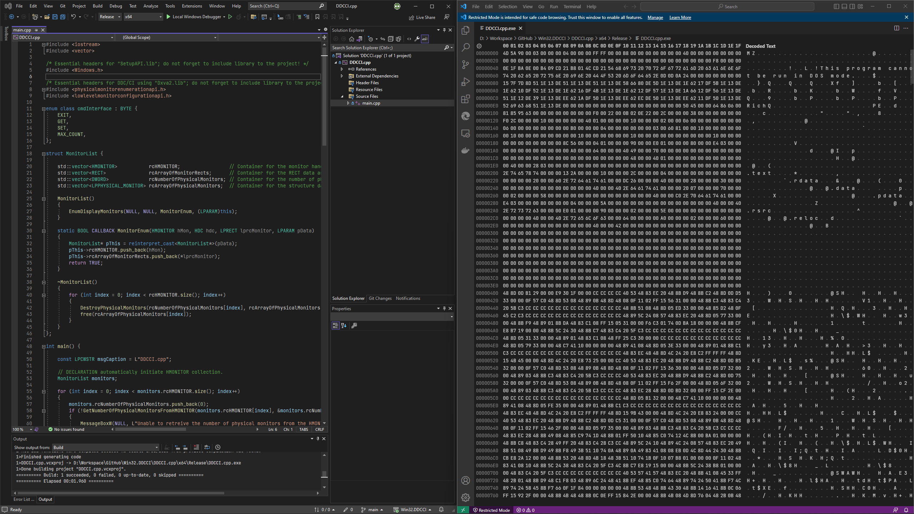

# 컴파일러
[컴파일러](https://ko.wikipedia.org/wiki/컴파일러)(compiler)는 하나의 프로그래밍 언어를 다른 언어로 변환(일명 컴파일; compile)하는 언어 처리 소프트웨어이다.

컴파일러를 사용하는 대표적인 [C](ko.C.md)/[C++](ko.Cpp.md) 프로그래밍 언어는 [CPU](ko.Processor.md)가 직접적으로 수행할 수 있는 [기계어](#기계어)로 컴파일되다 보니, 흔히 [고급 프로그래밍 언어](https://ko.wikipedia.org/wiki/고급_프로그래밍_언어)를 [저급 프로그래밍 언어](https://ko.wikipedia.org/wiki/저급_프로그래밍_언어)로 변환하는 국한적인 작업으로 오해한다. 하지만 [파이썬](ko.Python.md) 및 [자바](ko.Java.md) 프로그래밍 언어는 [바이트코드](ko.Interpreter.md#바이트코드)라는 [중간 언어](https://ko.wikipedia.org/wiki/중간_표현)로 변환하는 컴파일러가 존재하며, 심지어 [타입스크립트](ko.TypeScript.md) 프로그래밍 언어의 컴파일러는 [자바스크립트](ko.JavaScript.md)라는 또 다른 고급 프로그래밍 언어로 변환한다.

>  프로그래밍 언어는 설계된 당시의 철학과 기술적 한계를 효율적으로 극복하기 위해 여러 기술들을 복합적으로 작용하면서 컴파일 언어와 [인터프리트 언어](ko.Interpreter.md)의 경계를 허물고 있다.

아래는 C++ 프로그래밍 언어의 `.CPP` 확장자 소스 코드(左)가 [MSVC](https://ko.wikipedia.org/wiki/마이크로소프트_비주얼_C++) 컴파일러에 의해 기계어로 구성된 `.EXE` 실행 파일(右)로 컴파일 된 예시이다.

### 기계어
[기계어](https://ko.wikipedia.org/wiki/기계어)(maachine code)는 컴퓨터 [프로세서](ko.Processor.md)(central processing unit; CPU)의 연산 및 동작을 직접 제어할 수 있는 `0`과 `1`만으로 구성된 [이진 코드](https://ko.wikipedia.org/wiki/이진_코드)(binary code)이다. CPU에는 [x86](https://ko.wikipedia.org/wiki/X86), [ARM](https://ko.wikipedia.org/wiki/ARM_아키텍처) 등 다양한 [아키텍처](https://ko.wikipedia.org/wiki/명령어_집합)(architecture)가 있는데, 각각 연산 및 동작을 수행하기 위한 이진 코드가 설계상 이유로 서로 다르므로 동일한 운영체제라도 호환성 문제가 발생한다.

> 프로그래밍에서는 이진 코드의 가독성을 높이기 위해 팔진법이나 십진법으로 나타내기도 하지만 그 중에서 [십육진법](https://ko.wikipedia.org/wiki/십육진법)(hexadecimal)이 가장 많이 사용된다.

## AOT 컴파일
[AOT 컴파일](https://ko.wikipedia.org/wiki/AOT_컴파일)(Ahead-of-time compilation)은 프로그램을 실행하기 전에 미리 다른 언어로 변환하는 컴파일 작업이다. 컴파일을 마친 프로그램은 추가 작업이 필요없이 실행되므로 속도가 매우 빠르다는 장점을 가진다. 다만, 변경된 소스 코드를 시험하기 위해서는 새로 컴파일해야 하는 불편함이 다소 존재한다.

AOT 컴파일을 활용하는 대표적인 프로그래밍 언어로 C/C++가 있다: `.C` 혹은 `.CPP` 확장자의 각 소스 코드마다 컴파일러에 의해 기계어로 구성된 `.OBJ` (유닉스 기반의 경우 `.O`) 확장자의 [오브젝트 파일](https://ko.wikipedia.org/wiki/목적_파일)로 컴파일된다. 파편적인 오브젝트 파일들은 [링커](https://ko.wikipedia.org/wiki/링커_(컴퓨팅))(linker)에 의해 연동되어 최종적으로 완전한 `.EXE` 실행 파일, `.LIB` 정적 혹은 `.DLL` 동적 라이브러리(유닉스 기반의 경우 `.A` 혹은 `.SO`)로 [빌드](https://ko.wikipedia.org/wiki/소프트웨어_빌드)된다.

## JIT 컴파일
> 본 내용은 [인터프리터](ko.Interpreter.md)에 관한 내용이 상당히 포함되어 있어, 해당 문서를 우선 읽어보는 것을 권장한다.

[JIT 컴파일](https://ko.wikipedia.org/wiki/JIT_컴파일)(Just-in-time compilation)은 프로그램을 실행하는 [런타임](https://ko.wikipedia.org/wiki/런타임) 도중에 다른 언어로 변환하는 컴파일 작업이다. JIT 컴파일은 전통적인 [AOT 컴파일](#aot-컴파일)의 빠른 실행 속도와 인터프리터의 유연함을 모두 지니지만, 동시에 두 기술의 [오버헤드](https://ko.wikipedia.org/wiki/오버헤드)가 중첩(즉, [컴파일 타임](https://ko.wikipedia.org/wiki/컴파일_타임) + [링크 타임](https://ko.wikipedia.org/wiki/링크_타임) + 인터프리트 오버헤드)되는 단점도 공존한다.

일반적으로 AOT 컴파일러의 부산물인 바이트코드를 런타임 도중에 기계어로 JIT 컴파일하여 실시간으로 실행한다. 개발한 프로그램을 최초로 실행할 때는 JIT 컴파일에 소비된 시간으로 지연이 불가피하지만, 자츰 컴파일 정보가 [캐싱](https://ko.wikipedia.org/wiki/캐시)되면서 성능 향상을 위한 런타임 [최적화](https://en.wikipedia.org/wiki/Adaptive_optimization)에 활용된다. 이와 같이 JIT 컴파일은 실행되는 코드를 지속적으로 분석하여 컴파일로 취할 수 있는 이점과 실점을 저울질한다.

대표적인 JIT 컴파일 예시로 [.NET](ko.Csharp.md#net) 기반의 프로그래밍 언어가 있다. [자바](ko.Java.md) [플랫폼](https://ko.wikipedia.org/wiki/자바_(소프트웨어_플랫폼))과 [자바스크립트](ko.JavaScript.md) [엔진](https://ko.wikipedia.org/wiki/자바스크립트_엔진)의 경우, 본래 인터프리터를 사용하였으나 성능 향상이 중시된 현재에는 JIT 컴파일로 대체되었다.

# 같이 보기
* [인터프리터](ko.Interpreter.md)
