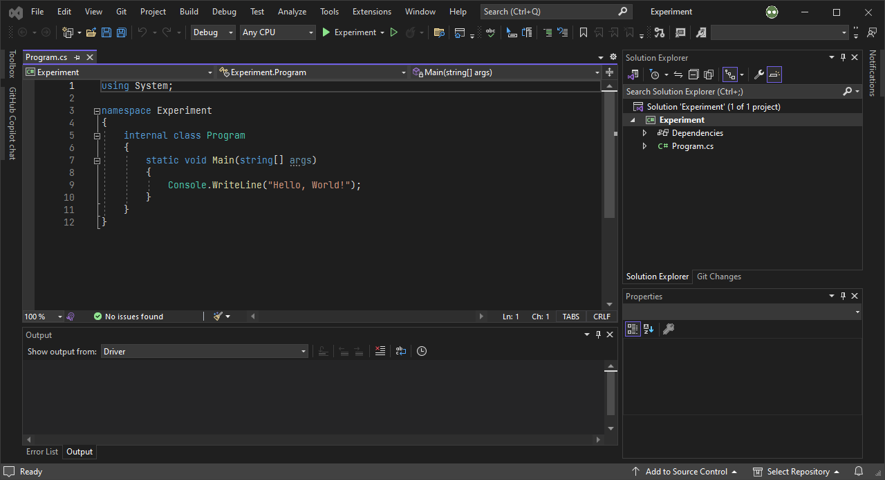

# C#
[C#](https://learn.microsoft.com/en-us/dotnet/csharp/)(한국어:씨샵)은 마이크로소프트에서 개발한 [객체지향 프로그래밍 언어](https://ko.wikipedia.org/wiki/객체_지향_프로그래밍)(일명 OOP)이며, [자바](https://ko.wikipedia.org/wiki/자바_(프로그래밍_언어))와 유사하게 설계되었지만 문법적으로 [C](ko.C)/[C++](ko.Cpp) 언어를 연상케 한다. [.NET](#net)의 지원으로 [데스크탑](https://ko.wikipedia.org/wiki/응용_소프트웨어), [모바일](https://ko.wikipedia.org/wiki/모바일_응용_소프트웨어), 그리고 [웹 어플리케이션](https://ko.wikipedia.org/wiki/웹_애플리케이션)에도 활용되는 범용성을 지닌다. 간단함과 편리함을 추구하는데, 만일 C 유형의 언어에 이미 익숙한 개발자들에게 C# 언어는 쉽게 배울 수 있는 장점을 지닌다. (비록 한국에서는 인지도가 낮으나) 폭넓은 커뮤니티를 보유하고 있어 관련 자료 검색에도 용이하다.

OOP 언어는 "객체"라는 데이터를 위주로 프로그램을 개발되며, 아래는 객체에 대한 관련 용어을 간략히 소개한다:

<table style="width: 95%; margin: auto;">
<caption style="caption-side: top;">OOP 핵심 용어의 간략 소개</caption>
<colgroup><col style="width: 33.3%;"/><col style="width: 33.4%;"/><col style="width: 33.3%;"/></colgroup>
<thead><tr><th style="text-align: center;">객체</th><th style="text-align: center;">맴버</th><th style="text-align: center;"><a href="#클래스">클래스</a></th></tr></thead>
<tbody><tr style="vertical-align: top; text-align: center;"><td>데이터를 저장한 공간(<a href="#변수">필드</a>)과 동작을 수행하는 코드(<a href="#함수">메소드</a>)의 묶음</td><td>객체 구성원: 필드, 메소드 등</td><td>맴버들이 정의되어 객체를 생성하는 <a href="#자료형">자료형</a></td></tr>
</tbody>
</table>

## .NET
[.NET](https://ko.wikipedia.org/wiki/닷넷)은 마이크로소프트에서 개발한 [오픈소스](https://github.com/dotnet/dotnet) [소프트웨어 프레임워크](https://ko.wikipedia.org/wiki/소프트웨어_프레임워크)이며, 프로그래밍에 방대하고 다양한 기능과 지원을 제공하는 핵심 요소이다. 국제표준기구 ISO와 ECMA에서 표준으로 채택된 공통 언어 기반(Common Language Infrasturcture; CLI)이 적용되어 운영체제 및 아키텍쳐가 다르더라도 [크로스 플랫폼](https://ko.wikipedia.org/wiki/크로스_플랫폼)(cross-platform)을 지원해야 한다.

.NET 컴파일러 플랫폼, 일명 <a href="https://en.wikipedia.org/wiki/Roslyn_(compiler)">Roslyn</a>은 소스 코드에서 이진코드가 아닌 [바이트코드](https://ko.wikipedia.org/wiki/바이트코드)를 [공통 중간 언어](https://ko.wikipedia.org/wiki/공통_중간_언어)(Common Intermediate Language; CIL)로 채택한 [어셈블리](https://learn.microsoft.com/en-us/dotnet/standard/assembly/) 파일을 생성한다. 바이트코드 특성상 컴퓨터가 읽을 수 있는 기계어는 아니지만 아키텍처 독립 언어로 크로스 플랫폼 지원이 가능하여, C# 언어 이외에도 .NET은 [비주얼 베이직](https://ko.wikipedia.org/wiki/비주얼_베이직_닷넷), [F#](https://ko.wikipedia.org/wiki/F_샤프), 그리고 [파워셸](ko.PowerShell.md) 언어도 지원한다.

> 어셈블리는 .exe 혹은 .dll 파일로 컴파일되지만, <a href="https://ko.wikipedia.org/wiki/기계어">기계어</a>가 아니기 때문에 단독적으로 실행이 불가하며 .NET CLR의 추가 [JIT 컴파일](ko.Compiler.md#jit-컴파일)이 반드시 필요하다.


프레임워크는 FCL(혹은 CoreFX) 그리고 CLR(혹은 CoreCLR)로 구성되어 있으며 아래의 표는 이들의 역할을 간략하게 설명한다:

<table style="table-layout: fixed; width: 80%; margin: auto;">
<caption style="caption-side: top;">.NET 구성요소</caption>
<colgroup><col style="width: 50%;"/><col style="width: 50%;"/></colgroup>
<thead><tr><th style="text-align: center;"><a href="https://en.wikipedia.org/wiki/Framework_Class_Library">프레임워크 클래스 라이브러리</a>(FCL)</th><th style="text-align: center;"><a href="https://ko.wikipedia.org/wiki/공통_언어_런타임">공통 언어 런타임</a>(CLR)</th></tr></thead>
<tbody>
<tr><td>.NET 프로그램 개발에 필요한 <a href="https://ko.wikipedia.org/wiki/표준_라이브러리">표준 라이브러리</a>를 제공한다.</td><td><a href="ko.Compiler.md#jit-컴파일">JIT 컴파일러</a>를 통해 .NET 프로그램을 컴파일 및 실행한다.</td></tr>
</tbody>
</table>

### .NET 프레임워크
[.NET 프레임워크](https://ko.wikipedia.org/wiki/닷넷_프레임워크)(.NET Framework)는 .NET 이전에 활발히 사용되던 [윈도우 NT](ko.Windows.md) 데스크탑에서만 사용할 수 있는 프레임워크이다. 비록 2020년 11월부로 [.NET Core](#net)(현재 .NET)가 주요 프레임워크로 전환되었으나, 마이크로소프트는  [누적 업데이트](ko.Update.md#waas)를 배포하는 등 .NET 프레임워크를 [윈도우 OS](ko.Windows.md)에서 제거할 계획이 없음을 [발표](https://learn.microsoft.com/en-us/dotnet/core/whats-new/dotnet-5#net-5-doesnt-replace-net-framework)했다. 다만, 새로운 어플리케이션 개발에 있어서는 [.NET 6](https://learn.microsoft.com/en-us/dotnet/core/whats-new/dotnet-6) 버전 이상을 사용하는 걸 적극 권장한다.

> .NET 프레임워크는 4.x 버전 번호를 유지할 것으로 보이며, 현재까지도 새로운 빌드가 [출시](https://learn.microsoft.com/en-us/dotnet/framework/whats-new/) 및 [지원](https://learn.microsoft.com/en-us/lifecycle/products/microsoft-net-framework)되고 있다.

## 프로젝트
다음은 비주얼 스튜디오 2022을 위주로 C# 프로젝트 구축에 대하여 설명한다.



[C# 9.0](https://learn.microsoft.com/en-us/dotnet/csharp/whats-new/csharp-9) 업데이트를 기점으로 비주얼 스튜디오에서 C# 콘솔 프로젝트를 생성할 때 [새로운 템플릿](https://learn.microsoft.com/en-us/dotnet/core/tutorials/top-level-templates)이 제공되며, 아래는 이전과 이후 소스 코드를 비교한다.

<table style="table-layout: fixed; width: 95%; margin: auto;">
<caption style="caption-side: top;">C# 9.0 전후 콘솔 프로젝트 비교</caption>
<colgroup><col style="width: 50%;"/><col style="width: 50%;"/></colgroup>
<thead><tr><th style="text-align: center;">C# 9.0 이전</th><th style="text-align: center;">C# 9.0 이후</th></tr></thead>
<tbody>
<tr style="text-align: center;"><td>초창기 .NET 5 또는 이전 버전</td><td>현재 .NET 5 또는 이후 버전</td></tr><tr style="vertical-align: top; overflow-wrap: break-word;"><td>

```cs
using System;

namespace Experiment
{
    class Program
    {
        static void Main(string[] args)
        {
            Console.WriteLine("Hello World!");
        }
    }
}
```
</td><td>

```cs
Console.WriteLine("Hello World!");
```
</td></tr><tr><td><code>Main()</code> 진입점이 C# 프로젝트명의 <a href="#네임스페이스">네임스페이스</a> 안에 위치한다. 객체지향 프로그래밍의 성격이 잘 드러나는 정석적인 코드이다.</td><td><code>Main()</code> 진입점이 컴파일러에 의해 <a href="#전역-네임스페이스">전역 네임스페이스</a>에 생성된다. <a href="https://learn.microsoft.com/en-us/dotnet/csharp/fundamentals/program-structure/top-level-statements">최상위 문장</a>(top-level statements)은 코드를 간결하게 표현하지만 암묵적인 규칙들이 존재한다.</td></tr>
</tbody>
</table>

본 문서는 가독성을 위해 후자에서 선보인 최상위 문장이 작용한 코드를 예시로 활용할 예정이다.

# 구문
[구문](https://ko.wikipedia.org/wiki/구문_(프로그래밍_언어))(syntax)은 프로그래밍 언어에서 문자 및 기호들의 조합이 올바른 문장 또는 표현식을 구성하였는지 정의하는 규칙이다. 각 프로그래밍 언어마다 규정하는 구문이 다르며, 이를 준수하지 않을 시 해당 프로그램은 빌드되지 않거나, 실행이 되어도 오류 및 의도치 않은 동작을 수행한다.

다음은 C# 언어에서 구문에 관여하는 요소들을 소개한다:

* **[표현식](https://learn.microsoft.com/en-us/dotnet/csharp/language-reference/language-specification/expressions)(expression)**
    
    값을 반환하는 구문적 존재를 가리킨다. 표현식에 대한 결과를 도출하는 것을 평가(evaluate)라고 부른다.
    
    ```cs
    2 + 3           // 숫자 5를 반환
    2 < 3           // 논리 참을 반환
    ```

* **[토큰](https://learn.microsoft.com/en-us/dotnet/csharp/language-reference/language-specification/lexical-structure#64-tokens)(token)**

    표현식을 구성하는 가장 기본적인 요소이며, 대표적으로 [키워드](https://learn.microsoft.com/en-us/cpp/cpp/keywords-cpp)(keyword), [식별자](#식별자)(identifier), [숫자](https://learn.microsoft.com/en-us/cpp/cpp/numeric-boolean-and-pointer-literals-cpp) 및 [문자열 리터럴](https://learn.microsoft.com/en-us/cpp/cpp/string-and-character-literals-cpp)(literal) 등이 있다.

    ```cs
    variable        // 식별자
    2               // 정수 리터럴
    ```

* **[문장](https://learn.microsoft.com/en-us/dotnet/csharp/language-reference/language-specification/statements)(statement)**
    
    실질적으로 무언가를 실행하는 구문적 존재를 가리킨다: 흔히 하나 이상의 표현식으로 구성되지만, [`break`](#break-문) 및 [`continue`](#continue-문)와 같이 독립적으로 사용되는 문장도 있다. 러스트 프로그래밍 언어는 [세미콜론](https://ko.wikipedia.org/wiki/새줄_문자)(semicolon) `;`을 기준으로 문장을 분별한다. 

    ```cs
    int variable = 2 + 3;      // 숫자 5를 "variable" 변수에 초기화
    if (2 < 3) statement;      // 논리가 참이면 "statement" 문장 실행
    ```

* **[블록](https://ko.wikipedia.org/wiki/블록_(프로그래밍))(block)**

    한 개 이상의 문장들을 한꺼번에 관리할 수 있도록 묶어놓은 소스 코드상 그룹이다. 블록 안에 또 다른 블록이 상주할 수 있으며, 이를 네스티드 블록(nested block)이라고 부른다. C#에서는 한 쌍의 중괄호 `{}`로 표시된다.

    ```cs
    {
        int variable = 2 + 3;
        if (2 < 3) statement;
    }
    ```

### 식별자
[식별자](https://learn.microsoft.com/en-us/dotnet/csharp/fundamentals/coding-style/identifier-names)(identifier)는 프로그램을 구성하는 데이터들을 구별하기 위해 사용되는 명칭이다. 즉, 식별자는 개발자가 데이터에 직접 붙여준 이름이다. C++에서 식별자를 선정하는데 아래의 규칙을 지켜야 한다.

1. 알파벳, 숫자, 밑줄 `_`만 허용 (그 외 특수문자 및 공백 사용 불가)
2. 식별자의 첫 문자는 숫자가 될 수 없음
3. 대소문자 구분 필수
4. [예약어](https://ko.wikipedia.org/wiki/예약어) 금지

### 주석
[주석](https://learn.microsoft.com/en-us/dotnet/csharp/language-reference/tokens/comments)(comment)은 프로그램의 소스 코드로 취급하지 않아 실행되지 않는 영역이다. 흔히 코드에 대한 간단한 정보를 기입하기 위해 사용되는 데 C# 언어에는 한줄 및 블록, 그리고 문서 주석이 존재한다. 아래 그림은 문서 주석의 예시를 보여준다.


<table style="table-layout: fixed; width: 95%; margin: auto;">
<caption style="caption-side: top;">C# 주석 종류</caption>
<colgroup><col style="width: 50%;"/><col style="width: 50%;"/></colgroup>
<thead><tr><th style="text-align: center;">한줄/블록 주석</th><th style="text-align: center;"><a href="https://learn.microsoft.com/en-us/dotnet/csharp/language-reference/language-specification/documentation-comments">문서 주석</a></th></tr></thead>
<tbody>
<tr><td>실행 파일 안에는 주석의 어떠한 정보도 저장되지 않는다.</td><td>XML 형식으로 설명을 덧붙일 수 있도록 한다. 해당 코드 위에 마우스를 올리면 내용을 바로 확인할 수 있다.</td></tr>
<tr style="vertical-align: top; overflow-wrap: break-word;"><td>

```cs
// 한줄 주석: 코드 한 줄을 차지하는 주석이다.

/*
    블록 주석:
    코드 여러 줄을 차지하는 주석이다.
*/
```
</td><td>

```cs
/// <summary>한줄 문서 주석</summary>

/**
    <summary>범위 문서 주석:
    코드 여러 줄을 차지하는 문서 주석이다.</summary>
 */
```
</td></tr>
</tbody>
</table>
