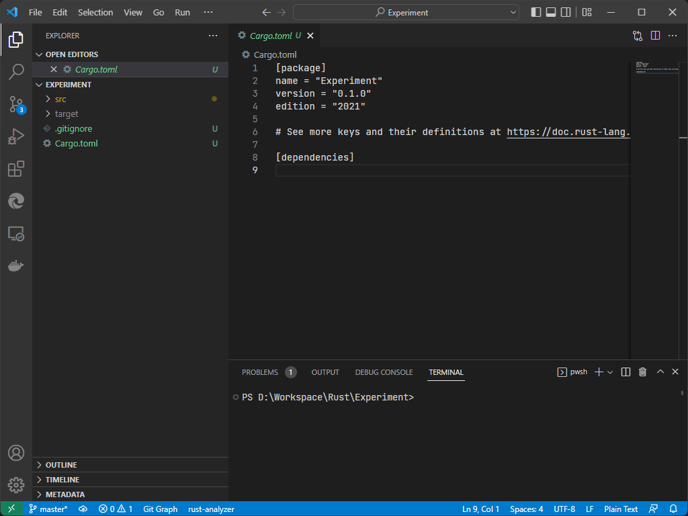

# 소개
> *출처: [The Rust Programming Language <sub>(영문)</sub>](https://doc.rust-lang.org/book/)*

[러스트](https://www.rust-lang.org/)(Rust)는 성능과 보안이 매우 강조된 프로그래밍 언어이며, 특히 자료형 및 메모리 관리 측에서 강점을 지닌다. 뿐만 아니라, 하드웨어 제어가 가능하다는 점에서 [펌웨어](https://ko.wikipedia.org/wiki/펌웨어) 개발에도 활용할 수 있다. 이러한 특성들에 의해 [C++](ko.Cpp.md) 언어와 유사한 성능을 지닌 동시에 훌륭한 보안성이 보장되어 [마이크로소프트](https://www.microsoft.com/), [구글](https://www.google.com/), [아마존](https://www.amazon.com/) 등의 주요 IT 기업의 관심과 지원을 받고 있다.

## 컴파일러
러스트 프로그래밍 언어는 `rustc`라는 AOT [컴파일러](ko.Compiler.md)(compiler)를 사용한다. 

# 설치
러스트 프로그래밍 언어를 실행하는 데 필요한 [툴체인](https://ko.wikipedia.org/wiki/툴체인)은 공식 홈페이지에서 `rustup_init.exe`을 [다운로드](https://www.rust-lang.org/tools/install) 받아 설치한다.

> 설치 과정에서 2013 버전 이상의 [비주얼 스튜디오](https://visualstudio.microsoft.com/downloads/)이 요구되는 데, 미리 Desktop development with C++ 그리고 윈도우 10 또는 11 SDK를 준비하도록 한다.


여기서 러스트 프로그래밍 언어의 툴체인(toolchain)이란, 소프트웨어 제품 개발에 활용되는 프로그래밍 도구들의 집합을 가리키며 대표적으로 다음 세 개의 프로그램이 있다.

* `rustc`: 러스트 컴파일러
* [`cargo`](https://doc.rust-lang.org/rust-by-example/cargo.html): 러스트 패키지 관리자
* `rustup`: 러스트 툴체인 관리자, 즉 위의 `rustc` 및 `cargo` 프로그램을 다른 버전으로 설치 및 선택한다.

설치가 완료되면 `%UserProfile%`에 두 경로가 생성된다: `.rustup` 그리고 `.cargo` 폴더이다. 전자는 러스트 툴체인이 실질적으로 설치되는 공간으로, 설치된 툴체인은 `toolchains` 하위폴더에 저장된다. 이렇게 설치된 여러 툴체인들 중에서 원하는 버전으로 경로를 바꿔가며 사용하는 번거로움을 해소하기 위해, 후자 폴더에 위치한 `rustc` 또는 `cargo` 등 명령어 프로그램들은 `rustup`에서 선택한 버전으로 연동된다. 그러므로 콘솔창은 `.cargo` 폴더에서 벗어나지 않고서도 다양한 버전의 툴체인을 활용할 수 있게 된다.

## 통합 개발 환경
[통합 개발 환경](https://ko.wikipedia.org/wiki/통합_개발_환경)(integrated development environment; IDE)은 최소한 프로그래밍 언어의 소스 코드 편집, 프로그램 빌드, 그리고 디버깅 기능을 제공하는 소프트웨어 개발 프로그램이다. 툴체인은 러스트 코드를 컴퓨터가 실행할 수 있도록 하는 개발 도구이지만 러스트 코드 편집기는 아니다. 러스트 코드를 작성하고 프로그램으로 실행하여 문제가 발생하면 검토할 수 있는 IDE가 절대적으로 필요하다.

### 비주얼 스튜디오 코드
[비주얼 스튜디오 코드](https://ko.wikipedia.org/wiki/비주얼_스튜디오_코드)<sub>([다운로드](https://code.visualstudio.com/download))</sub>, 일명 VS Code는 마이크로소프트에서 개발한 무료 소스 코드 편집기이다. 비록 기술적으로 IDE는 아니지만, rust-analyzer 확장도구<sub>([다운로드](https://marketplace.visualstudio.com/items?itemName=rust-lang.rust-analyzer))</sub>를 설치하면 코드 자동완성, 자료형 정의, 구문 하이라이트 등의 기능들을 제공한다.

> 본 문서는 VS Code를 기준으로 러스트 프로그래밍을 소개한다.

# 프로젝트
러스트 프로그래밍 언어는 [`cargo`](https://doc.rust-lang.org/rust-by-example/cargo.html)라는 공식 패키지 관리 도구를 통해 프로젝트를 관리한다.



프로젝트를 [빌드](https://ko.wikipedia.org/wiki/소프트웨어_빌드)하거나 실행하기 위해 각각 `cargo build` 그리고 `cargo run` 명령어를 사용된다. 러스트 프로그래밍 언어의 독특한 기능 중 하나는 결과물을 생성하지 않은 채 컴파일이 가능한지 여부를 `cargo check` 명령어로 확인할 수 있다. 이는 소스 코드를 컴파일하는 데 소모되는 시간이 생략되므로 코드 유효성을 확인하기에 매우 유용하다.

## 크레이트
[크레이트](https://doc.rust-lang.org/rust-by-example/crates.html)(crate; 화물상자)는 컴파일로 생성된 가장 작은 단위의 결과물이며, 간단히 말해 `.RS` 소스 파일(일명 크레이트 파일; crate file)로부터 생성된 실행 및 라이브러리 파일이다. 크레이트 파일 중에서 러스트 프로그래밍 컴파일의 근본이 되는 소스 파일을 크레이트 루트(crate root)이라고 부른다.

크레이트는 아래와 같이 두 유형으로 나뉘어진다:

<table style="width: 70%; margin: auto;">
<caption style="caption-side: top;">이진 및 라이브러리 크레이트 비교</caption>
<colgroup><col style="width: 16%;"/><col style="width: 44%;"/><col style="width: 44%;"/></colgroup>
<thead><tr><th></th><th style="text-align: center;">이진 크레이트 (binary crate)</th><th style="text-align: center;">라이브러리 크레이트 (library crate)</th></tr></thead>
<tbody><td>설명</td><td style="text-align: center;"><code>.EXE</code> 실행 프로그램</td><td style="text-align: center;"><code>.RLIB</code> 라이브러리 파일</td></tbody>
<tbody><td>크레이트 루트</td><td style="text-align: center;"><code>src/main.rs</code></td><td style="text-align: center;"><code>src/lib.rs</code></td></tbody>
<tbody><td><code>main</code> 진입점</td><td style="text-align: center;">⭕</td><td style="text-align: center;">❌</td></tbody>
</table>

> 러스트 프로그래밍에서 크레이트를 이야기하면 흔히 "라이브러리 크레이트"를 가리키며, 이는 일반 프로그래밍 언어에서의 "[라이브러리](ko.C.md#라이브러리)"와 혼용되어 언급되기도 한다.

## 패키지
패키지(package)는 하나 이상의 [크레이트](#크레이트)를 다루는 [번들](https://en.wikipedia.org/wiki/Product_bundling#Software)(bundle)이다. 각 패키지는 여러 개의 이진 크레이트를 다룰 수 있지만, 라이브러리 크레이트는 오로지 하나만 가능하다. 패키지의 특징 중 하나는 [`Cargo.toml`](#cargotoml) 파일을 가지고 있다는 점인데, 이는 크레이트를 어떻게 빌드를 할 것인지 설명한다.

> 러스트 프로그래밍에서 프로젝트를 생성한다는 것이 바로 패키지를 가리키며, 새로운 패키지를 생성하려면 아래 명령어를 입력한다.
> 
> ```terminal
> cargo new <프로젝트명>
> ```
