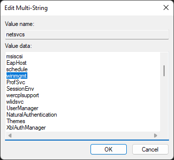

# 윈도우 서비스
[윈도우 서비스](https://ko.wikipedia.org/wiki/윈도우_서비스)(Windows Service)는 [서비스 제어 관리자](#서비스-제어-관리자)로부터 관리받는 프로그램이다.

<table style="width: 80%; margin: auto;">
<caption style="caption-side: top;">프로세스와 서비스의 차이</caption>
<colgroup><col style="width: 15%;"/><col style="width: 45%;"/><col style="width: 20%;"/><col style="width: 20%;"/></colgroup>
<thead><tr><th style="text-align: center;">프로그램</th><th style="text-align: center;">생명주기</th><th style="text-align: center;">복수 객체의 존재 가능</th><th style="text-align: center;">GUI 활용 가능</th></tr></thead>
<tbody>
<tr><td style="text-align: center;"><a href="ko.Process.md">프로세스</a></td><td>사용자 세션에 종속</td><td style="text-align: center;">✔️</td><td style="text-align: center;">✔️</td></tr>
<tr><td style="text-align: center;">서비스</td><td>서비스만을 위한 ID 0의 전용 세션에서 실행</td><td style="text-align: center;">❌<br/>(각 서비스마다 객체 하나만 존재)</td><td style="text-align: center;">❌<br/>(기피되어야 할 사항)</td></tr>
</tbody>
</table>

> 위의 표로부터 다음과 같은 서비스 성질을 파악할 수 있다: (1) 사용자 로그인 없이도 실행되며 (2) 사용자가 로그아웃 하여도 실행된다.

서비스는 서비스 제어 관리자에서 지정된 [인터페이스](https://ko.wikipedia.org/wiki/API) 규칙을 반드시 준수해야 한다. 즉, 단순히 프로그램이 백그라운드에서 동작하고 있다는 이유로 서비스라고 추정해서는 안된다. 서비스의 실행과 중단은 전부 API를 통해 이루어지기 때문에 사용자 및 외부 프로세스의 간섭이 최소화된다.

### 보호된 서비스
보호된 서비스(protected service)는 시스템에 추가적인 보호를 제공하는 서비스이다.

1. 조기 실행 맬웨어 방지(Early Launch Antimalware; ELAM)
2. 이진 서명

서비스 제어 관리자는 보호된 서비스를 시작하기 전에 자격 유효성을 검증하며, 비보호 프로세스 및 관리자 권한으로도 보호된 서비스를 중지할 수 없다.

## 서비스 제어 관리자
[서비스 제어 관리자](https://ko.wikipedia.org/wiki/서비스_제어_관리자)(Service Control Manager; SCM), 일명 [`services.exe`](https://www.file.net/process/services.exe.html) 프로그램은 [윈도우](ko.Windows.md)에서 서비스를 구동 및 관리하는 프로세스이다. 시스템이 부팅되어 운영체제가 초기화되는 과정에서 실행되는 프로세스이지만, 사용자가 서비스와 상호작용하기 위해 설계된 게 아니다.

만일 서비스를 직접 실행 및 중단해야 하는 등의 작업이 필요할 시, 서비스와 상호작용에 필연적인 API를 활용한 아래 프로세스를 사용할 수 있다.

* **`services.msc`**: [마이크로소프트 관리 콘솔](https://ko.wikipedia.org/wiki/마이크로소프트_관리_콘솔)을 통해 서비스 제어 관리자 데이터베이스에 등록된 서비스를 GUI로 확인하고 제어한다.
* **[`sc.exe`](https://www.file.net/process/sc.exe.html)**: 서비스 제어 관리자가 서비스를 관리하기 위해 필요한 데이터를 [생성](https://learn.microsoft.com/en-us/windows-server/administration/windows-commands/sc-create), [설정](https://learn.microsoft.com/en-us/windows-server/administration/windows-commands/sc-config), [제거](https://learn.microsoft.com/en-us/windows-server/administration/windows-commands/sc-delete), 그리고 [탐색](https://learn.microsoft.com/en-us/windows-server/administration/windows-commands/sc-query)하는 명령어 기반 프로세스이다.

그 외에도 [파워셸](https://ko.wikipedia.org/wiki/파워셸), 작업 관리자, MSConfig 등을 사용할 수 있다.

# 서비스 호스트
[서비스 호스트](https://en.wikipedia.org/wiki/Svchost.exe)(일명 svchost.exe)는 하나 이상의 `.DLL` [동적 링크 라이브러리](https://ko.wikipedia.org/wiki/동적_링크_라이브러리) 파일 형식의 서비스를 탑재할 수 있는 시스템 프로세스이다. 이러한 방식으로 여러 서비스가 단일 svchost.exe 프로세스 내에서 리소스를 공유한다.

* **장점**: 리소스 소모량 감소에 의한 메모리 공간 절약
* **단점**: 자칫 한 서비스에서 발생한 오류가 해당 svchost.exe에서 구동되는 모든 서비스에 영향을 미친다.

[윈도우 10 버전 1703](https://learn.microsoft.com/en-us/windows/application-management/svchost-service-refactoring) 또는 [윈도우 서버 2019](https://ko.wikipedia.org/wiki/윈도우_서버_2019) 운영체제부터 물리 메모리가 3.5 GB 이상이면 svchost.exe는 오로지 하나의 서비스만 탑재하도록 변경되었다.

* **장점**: 서비스 작업 실패로부터 시스템 시스템 내구성 증진; 수월해진 디버깅 작업
* **단점**: 메모리 사용량 증가

만일 해당 svchost.exe 변경을 미적용하려면 [`sc.exe config`](https://learn.microsoft.com/en-us/windows-server/administration/windows-commands/sc-config) 명령이나 서비스 레지스트리의 `SvcHostSplitDisable` 값을 설정해야 한다.

## 동작 원리
모든 서비스 레지스트리는 다음 레지스트리 키에서 찾아 볼 수 있다.

```terminal
HKLM\SYSTEM\CurrentControlSet\Services
```

서비스는 실행파일 위치를 알려주는 `ImagePath` 레지스트리 값이 존재한다. 본 장에서는 DLL 유형의 서비스 중 하나인 [Winmgmt](https://learn.microsoft.com/en-us/windows/win32/wmisdk/winmgmt) 서비스(일명 [WMI](https://learn.microsoft.com/en-us/windows/win32/wmisdk/wmi-start-page))를 예시로 들어, 실행파일이 svchost.exe로 지정된 것을 확인할 수 있다.


<table style="width: 60%; margin: auto;">
<caption style="caption-side: top;">svchost.exe 플래그 설명</caption>
<colgroup><col style="width: 10%;"/><col style="width: 85%;"/></colgroup>
<thread><tr><th style="text-align: center;">플래그</th><th style="text-align: center;">설명</th></tr></thead>
<tbody><tr><td style="text-align: center;"><code>-k</code></td><td>svchost.exe 중에서 어느 서비스 호스트 그룹으로 지정할 지 결정한다.</td></tr><tr><td style="text-align: center;"><code>-p</code></td><td>DynamicCodePolicy, BinarySignaturePolicy, 및 ExtensionPolicy 정책을 강행한다.</td></tr></tbody>
</table>

위의 `-k` 플래그가 설정된 서비스는 해당 서비스 호스트 그룹에 자신의 정보를 제공한다. 아래의 레지스트리 키에는 다양한 svchost.exe 호스트 그룹 목록 있는데, 각 레지스트리 값에는 탑재되는 서비스가 나열되어 있다.

```terminal
HKLM\SOFTWARE\Microsoft\Windows NT\CurrentVersion\Svchost
```

다음은 Winmgmt 서비스가 속하는 svchost.exe 레지스트리 값의 데이터이다.



그러므로, svchost.exe 중에서 `netsvcs` 그룹을 시작하면 WMI을 포함한 데이터에 나열된 서비스가 실행된다.

# 서비스 목록
다음은 본 사이트 문서에서 다루고 있는 윈도우 서비스 일부를 나열한다.

* [Windows Error Reporting](ko.WER.md)

# 참조
* [Protecting anti-malware services - Win32 apps &#124; Microsoft Learn](https://learn.microsoft.com/en-us/windows/win32/services/protecting-anti-malware-services-)
* [Service Host - Win32 apps &#124; Microsoft Learn](https://learn.microsoft.com/en-us/windows/win32/wsw/service-host)
* [Demystifying the "SVCHOST.EXE" Process and Its Command Line Options &#124; by Nasreddine Bencherchali &#124; Medium](https://nasbench.medium.com/demystifying-the-svchost-exe-process-and-its-command-line-options-508e9114e747)
