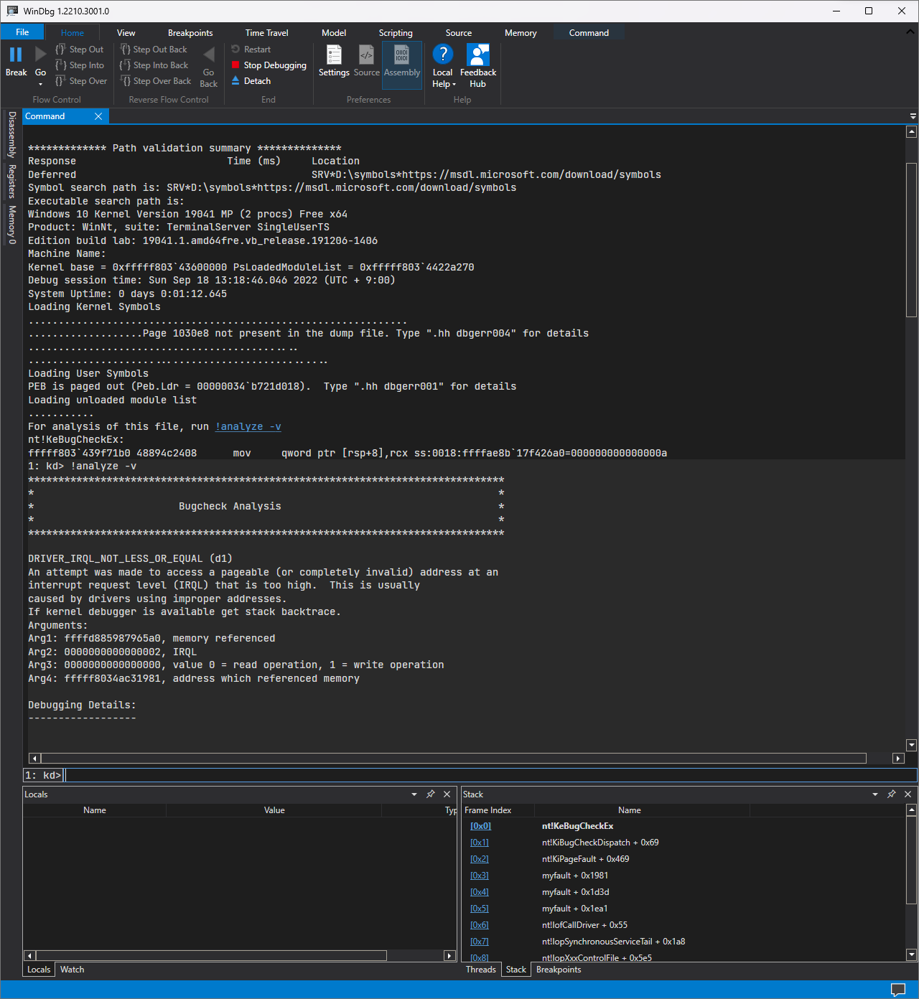

# WinDbg
[WinDbg](https://ko.wikipedia.org/wiki/WinDbg)<sub>([다운로드](https://apps.microsoft.com/store/detail/windbg-preview/9PGJGD53TN86))</sub>, 일명 윈도우 디버거(Windows Debugger)는 [윈도우](ko.Windows.md)에서 실행되는 [어플리케이션](ko.Process.md) 및 시스템 전체를 [디버깅](https://ko.wikipedia.org/wiki/디버그)하는 트러블슈팅 프로그램이다.

> 만일 윈도우 7 혹은 8.1 운영체제를 사용하거나, 혹은 Preview가 아닌 버전을 설치하려면 윈도우 [SDK](https://developer.microsoft.com/en-us/windows/downloads/windows-sdk/)를 통해 설치를 진행한다.



WinDbg는 흔히 어플리케이션 충돌이나 [블루스크린](ko.BSOD.md)으로 생성된 [덤프](ko.Dump.md) 파일을 분석하는 데 사용되며, 그 외에도 실시간 디버깅 및 TTD (Time Travel Debugging; 시간여행 디버깅) 등이 가능하다. 단, WinDbg는 [근본적인 원인 분석](https://en.wikipedia.org/wiki/Root_cause_analysis)을 위한 보조 도구에 불과하며 윈도우에서 발생한 모든 문제를 해결해 주는 게 아니다. 덤프에 남겨진 단서로부터 논리적이고 체계적인 방법론을 동원하여 합리적인 견해를 주장 및 조치 방안을 제시할 수 있어야 한다.

### 환경 변수 설정
WinDbg로부터 원활한 디버깅 작업을 진행하려면 아래와 같이 시스템 환경 변수를 설정하기를 권장한다.

<table style="width: 80%; margin: auto;">
<caption style="caption-side: top;">WinDbg 관련 환경 변수</caption>
<colgroup><col style="width: 30%;"/><col style="width: 70%;"/></colgroup>
<thead><tr><th style="text-align: center;">환경 변수</th><th style="text-align: center;">설명</th></tr></thead>
<tbody><tr><td style="text-align: center;"><code>_NT_SYMBOL_PATH</code></td><td><a href="ko.Symbol.md">심볼</a>(symbol) 서버 및 캐시 경로를 지정한다.</td></tr><tr><td style="text-align: center;"><code>_NT_DEBUGGER_EXTENSION_PATH</code></td><td>WinDbg 디버깅 확장도구가 위치한 폴더 경로를 명시한다: <a href="https://www.microsoft.com/en-us/download/details.aspx?id=53304">MEX</a> 확장도구 등</td></tr></tbody>
</table>

## 인터페이스
WinDbg에서 제공하는 화면이나 기능 등의 인터페이스에 대하여 소개한다.

### 명령창
명령창(command window)은 명령을 입력하고 그에 대한 출력이 나타나는 인터페이스이다. 어떤 덤프인지에 따라 명령창이 알려주는 정보는 다소 상이하다.

* **어플리케이션 덤프**

    콜론 `:`을 기준으로 좌측과 우측은 각각 현재 디버깅 중인 [프로세스](ko.Process.md)와 [스레드](ko.Process.md#스레드) 번호를 가리킨다; 이들은 WinDbg에서 부여한 상대적인 번호로 PID와 TID가 절대 아니다. 즉, 아래 그림은 WinDbg에서 인지한 0번 프로세스의 0번 스레드를 살펴보고 있음을 의미한다.

    

* **메모리 덤프**

    콜론 좌측의 숫자는 현재 디버깅되고 있는 [CPU](ko.Processor.md) 코어 번호를 가리킨다. 아래 그림은 WinDbg에서 0번 CPU를 살펴보고 있음을 의미하며, 만일 단일 코어 시스템일 경우에는 [커널](ko.Kernel.md) 디버깅을 의미하는 `kd`만 표시된다.
 
    

WinDbg에서 디버깅하고자 하는 스레드(어플리케이션 덤프 경우) 또는 CPU(메모리 덤프 경우) 번호는 [`~s`](https://learn.microsoft.com/en-us/windows-hardware/drivers/debugger/-s--change-current-processor-) 명령어를 통해 언제든지 변경 가능하다.

### 하이라이트
명령창 출력화면에서 관심있는 텍스트를 드래그하여 `CTRL+ALT+H` 단축키를 눌러 (토글 방식) 하이라이트를 입힐 수 있다. 해당 텍스트가 화면에 출력될 때마다 자동으로 하이라이트가 되기 때문에, 외우기 힘든 메모리 주소 등을 표시할 때 매우 유용하다.


## !analyze 확장도구
[!analyze](https://learn.microsoft.com/en-us/windows-hardware/drivers/debugger/-analyze)는 WinDbg에 기본적으로 탑재된 확장도구 중에서도 증상을 개략적으로 파악하는 데 유용하다. 하지만 해당 확장도구 또한 WinDbg와 마찬가지로 문제의 원인을 제시하는 도구가 아니며, 본 내용은 !analyze가 제시하는 자동 진단 내용이 무엇을 내포하는지 소개한다. !analyze 확장도구의 진단 내용은 [마이크로소프트 공식 문서](https://learn.microsoft.com/en-us/windows-hardware/drivers/debugger/using-the--analyze-extension)에서 확인할 수 있다.

<table style="width: 95%; margin: auto;">
<caption style="caption-side: top;">!analyze 출력화면 비교</caption>
<thead><tr><th style="text-align: center;">충돌 소프트웨어</th><th style="text-align: center;">출력화면 및 설명</th></tr></thead>
<colgroup><col style="width: 15%;" /><col style="width: 85%;" /></colgroup>
<tbody>
<tr><td rowspan="2" style="text-align: center;">어플리케이션</td><td>

```windbg
0:000> !analyze -v
*******************************************************************************
*                                                                             *
*                        Exception Analysis                                   *
*                                                                             *
*******************************************************************************

EXCEPTION_RECORD:  (.exr -1)
ExceptionAddress: 00007ff6ecfc1002 (ForceAppCrash!main+0x0000000000000002)
   ExceptionCode: c0000005 (Access violation)
  ExceptionFlags: 00000000
NumberParameters: 2
   Parameter[0]: 0000000000000001
   Parameter[1]: 0000000000000000
Attempt to write to address 0000000000000000
```
</td></tr>
<tr><td><a href="ko.C.md#예외-처리">예외</a>가 발생한 메모리 주소와 <a href="https://learn.microsoft.com/en-us/openspecs/windows_protocols/ms-erref/596a1078-e883-4972-9bbc-49e60bebca55">NTSTATUS</a> 코드를 알려주고 구체적인 정황을 매개변수로 설명한다. 위의 덤프에서는 0xC0000005 STATUS_ACCESS_VIOLATION이란 유효하지 않은 메모리에 데이터를 작성하려는 시도를 확인하였다.</td></tr>
<tr><td rowspan="2" style="text-align: center;">운영체제</td><td>

```windbg
0: kd> !analyze -v
*******************************************************************************
*                                                                             *
*                        Bugcheck Analysis                                    *
*                                                                             *
*******************************************************************************

DRIVER_IRQL_NOT_LESS_OR_EQUAL (d1)
An attempt was made to access a pageable (or completely invalid) address at an
interrupt request level (IRQL) that is too high.  This is usually
caused by drivers using improper addresses.
If kernel debugger is available get stack backtrace.
Arguments:
Arg1: ffffc4899e155720, memory referenced
Arg2: 0000000000000002, IRQL
Arg3: 0000000000000000, value 0 = read operation, 1 = write operation
Arg4: fffff803999612d0, address which referenced memory
```
</td></tr>
<tr><td><a href="https://learn.microsoft.com/en-us/windows-hardware/drivers/debugger/bug-check-code-reference2">Bugcheck</a>와 구체적인 정황을 소개하는 네 개의 매개변수를 알려준다. 위의 덤프는 DISPATCH_LEVEL 이상의 IRQL에서 유효하지 않는 메모리 주소에 데이터 작성을 시도하였음을 알리는 bugcheck <a href="https://learn.microsoft.com/en-us/windows-hardware/drivers/debugger/bug-check-0xd1--driver-irql-not-less-or-equal">0xD1 DRIVER_IRQL_NOT_LESS_OR_EQUAL</a>로 확인되었다.</td></tr>
</tbody>
</table>

아래는 어플리케이션과 운영체제 공통사항으로 출력되는 레지스터에 저장된 데이터 및 충돌이 발생한 스택을 보여준다.

```windbg
TRAP_FRAME:  ffff9e81031476e0 -- (.trap 0xffff9e81031476e0)
rax=00000000d34a8f72 rbx=0000000000000000 rcx=0000000000000000
rdx=ffffc4899d02bc60 rsi=0000000000000000 rdi=0000000000000000
rip=fffff803999612d0 rsp=ffff9e8103147870 rbp=ffff9e8103147ae1
    r8=0000000000000002  r9=ffffc4899e100000 r10=ffffc48997600300
r11=ffffc4899e14c710 r12=0000000000000000 r13=0000000000000000
r14=0000000000000000 r15=0000000000000000
iopl=0         nv up ei pl zr na po nc
myfault+0x12d0:
fffff803`999612d0 8b03            mov     eax,dword ptr [rbx] ds:00000000`00000000=????????

STACK_TEXT:  
ffff9e81`03147598 fffff803`7aa3e2a9     : 00000000`0000000a ffffc489`9e155720 00000000`00000002 00000000`00000000 : nt!KeBugCheckEx
ffff9e81`031475a0 fffff803`7aa39934     : 00000000`00000fff 00000000`00001001 00000000`00000001 00007ffe`00000000 : nt!KiBugCheckDispatch+0x69
ffff9e81`031476e0 fffff803`999612d0     : 00000000`656e6f4e ffffc489`9e14c720 ffff9e81`00000003 00000000`00000880 : nt!KiPageFault+0x474
ffff9e81`03147870 fffff803`9996168e     : fffff803`d34a8f72 ffff9e81`031478f8 00000000`00000000 00000000`00000000 : myfault+0x12d0
ffff9e81`031478a0 fffff803`999617f1     : ffffe681`038f55d0 fffff803`7b0e83a9 ffffe681`07a04db0 ffff9e81`031479a0 : myfault+0x168e
ffff9e81`031479e0 fffff803`7a8cf765     : ffffe681`038f55d0 00000000`00000002 00000000`0000000c ffff9e81`03147b20 : myfault+0x17f1
ffff9e81`03147a40 fffff803`7acddfc0     : ffffe681`038f55d0 ffff9e81`03147ae1 ffffe681`038f55d0 ffffe681`07a5fd60 : nt!IofCallDriver+0x55
ffff9e81`03147a80 fffff803`7acdc58c     : 00000000`00000000 00000000`83360018 ffff9e81`03147ea0 ffffe681`038f55d0 : nt!IopSynchronousServiceTail+0x1d0
ffff9e81`03147b30 fffff803`7acda866     : 00000000`00000000 00000000`00000000 00000000`00000000 00000000`00000000 : nt!IopXxxControlFile+0x72c
ffff9e81`03147d40 fffff803`7aa3d9e8     : 00000000`00000000 00000000`00000000 ffff75ba`5f10e2ea ffff9e81`03147ea0 : nt!NtDeviceIoControlFile+0x56
ffff9e81`03147db0 00007ffe`81aaeee4     : 00000000`00000000 00000000`00000000 00000000`00000000 00000000`00000000 : nt!KiSystemServiceCopyEnd+0x28
0000008e`15fbe968 00000000`00000000     : 00000000`00000000 00000000`00000000 00000000`00000000 00000000`00000000 : 0x00007ffe`81aaeee4
```

위의 내용들은 각각 [어셈블리](ko.Assembly.md)와 스택 기반의 [메모리](ko.Memory.md) 할당 등의 컴퓨터공학 및 윈도우 운영체제에 대한 이해도가 요구된다. 본 문서에서는 언급한 이론들을 설명하지 않을 것이며, WinDbg를 사용하여 분석하기 위해 알아야 할 사항과 명령, 그리고 방법론을 위주로 소개한다.

# 스택 해석하기
덤프로부터 [스레드](ko.Process.md#스레드) 스택을 읽는다는 건 증상이 발생한 당시 프로그램 혹은 시스템 상황을 이해하려는 디버깅의 기초이자 핵심인 작업 중 하나이다. 본 내용은 가급적 [WinDbg](#windbg)에서 제공하는 기본 명령만을 사용하여 스택을 해석하는 방법을 소개한다.

# 같이 보기
* [Debugger Commands - Windows drivers &#124; Microsoft Learn](https://learn.microsoft.com/en-us/windows-hardware/drivers/debugger/debugger-commands)
